# 📘 Flujos operativos de la app Zinergia

> **¿Qué es este documento?**
> Una guía pensada para **cualquier persona** —no hace falta saber programar— que necesite entender cómo funciona la app Zinergia: para qué sirve, quién la usa, cómo va el dinero, qué pasa pantalla por pantalla y qué riesgos hay que vigilar.
>
> **Si nunca has visto la app**, este documento te lleva de la mano desde lo más simple a lo más detallado.

---

## Cómo usar este documento sin perderte

Este documento tiene mucho detalle porque sirve para dos cosas distintas: entender la operativa de Zinergia y revisar la app pantalla por pantalla. No hace falta leerlo entero de una vez.

| Necesitas... | Ve directo a... | Resultado |
|---|---|---|
| Entender el negocio | Secciones 1 a 5 | Sabes quién usa la app, qué vende y cómo se cobra |
| Probar la app manualmente | Secciones 7 a 10 y checklist de la sección 13 | Tienes pasos claros para revisar cada pantalla |
| Revisar seguridad y datos | Secciones 11, 12 y anexos A/B | Sabes qué rutas, tablas y riesgos comprobar |
| Preparar una demo o formación | Secciones 2, 3, 8 y 9 | Puedes explicar el recorrido principal sin entrar en código |

### Lectura recomendada en 20 minutos

1. Lee la sección 2 para entender el flujo completo.
2. Mira el mapa de pantallas de la sección 3.
3. Salta a la sección 9.4, que explica el simulador OCR.
4. Lee la sección 9.8, porque ahí está el dinero: comisiones y retiradas.
5. Termina con la sección 13, que es la checklist universal.

### Qué significa cada bloque de una pantalla

Cuando una pantalla aparece explicada, normalmente sigue esta estructura:

- **Para qué sirve**: explicación sencilla del objetivo.
- **Qué se ve**: lo que debería encontrar el usuario.
- **Qué pasa por dentro**: resumen no técnico de la lógica.
- **Qué probar**: casos concretos para validar que funciona.
- **Riesgos**: puntos donde puede haber fuga de datos, errores de dinero o estados incoherentes.

> Nota importante: los nombres Carmen, Roberto, María y Juan son personajes ficticios para entender mejor los roles. No representan usuarios reales ni datos reales.

---

## ✋ Antes de empezar — ¿qué es Zinergia?

Imagina a **Juan**, dueño de una panadería. Cada mes paga **220 €** de luz. No sabe que con su consumo real podría pagar **170 €** con otra tarifa. Está perdiendo **600 € al año** sin enterarse.

**Zinergia** es la aplicación web que usan los comerciales energéticos para:

1. Pedirle a Juan su **última factura de la luz** (un PDF).
2. Subirla a la app, que **lee la factura sola** (la app extrae nombre, consumo, tarifa…).
3. **Comparar** lo que paga con lo que podría pagar en otras compañías.
4. Generarle una **propuesta comercial bonita** (un PDF que Juan puede leer en su móvil).
5. Juan **firma desde el móvil** y se cambia de compañía.
6. El comercial **gana una comisión**.

Eso es todo. La app convierte un PDF de factura en un cliente firmado y una comisión cobrada.

---

## 👥 Las cuatro personas que usan la app

Mejor que hablar de "roles", vamos a poner caras:

| Persona | Rol técnico | Qué hace en su día a día |
|---|---|---|
| 👑 **Carmen** (oficina central) | Admin | Configura las tarifas, ve estadísticas globales, aprueba pagos, atiende solicitudes RGPD |
| 🏢 **Roberto** (jefe de zona Madrid) | Franquicia | Recluta comerciales para su zona, supervisa sus ventas, aprueba sus retiradas |
| 👤 **María** (comercial) | Agente | Visita panaderías como la de Juan, sube facturas, manda propuestas, cobra comisiones |
| 🧾 **Juan** (cliente final) | — | Recibe un enlace por WhatsApp, abre la propuesta y firma desde el sofá |

> **Regla mental.** Cada vez que veas un emoji 👑 🏢 👤 🧾 en este documento, piensa en Carmen, Roberto, María o Juan. Eso te ayuda a entender quién está delante de la pantalla.

---

## 💰 Cómo se gana dinero — el modelo de negocio en una frase

> **Cuando Juan firma**, la compañía energética paga una comisión a Zinergia. Esa comisión se reparte: una parte para 👤 María, una parte para 🏢 Roberto y una parte para 👑 la central.

Por eso, en la app hay que vigilar mucho **dos cosas**:

1. Que **María solo vea sus comisiones** (no las de otro comercial).
2. Que cuando María dice *"quiero cobrar"*, el sistema **no le pague dos veces** por error.

Esto explica el porqué de muchas reglas de seguridad que verás más adelante.

---

## 📑 Cómo está organizado este documento

Hay **tres niveles de profundidad**. Lee solo el que necesites:

| Si tienes… | Lee… |
|---|---|
| 5 minutos | Secciones 1, 2 y 3: glosario, flujo principal y mapa de pantallas |
| 30 minutos | Añade secciones 5, 6 y 7: roles, estados y recorridos de prueba |
| 2 horas | Lee todo el documento, pantalla por pantalla |
| Perfil técnico | Usa también los anexos A y B: SQL de verificación y runbook de incidencias |

---

## 🎯 Los iconos que vas a ver

Para no leer todo el rato, fíjate en los iconos:

### Personas

| Icono | Quién es |
|:---:|---|
| 👑 | Admin (Carmen, oficina central) |
| 🏢 | Franquicia (Roberto, jefe de zona) |
| 👤 | Agente (María, comercial) |
| 🧾 | Cliente final (Juan, panadero) |

### Tipos de prueba (cuando hablamos de cómo verificar algo)

| Icono | Qué significa |
|:---:|---|
| ✅ | "El camino feliz": esto **debería funcionar** sin problemas |
| ❌ | "Error controlado": el usuario hace algo mal y la app **debe avisarle con claridad** |
| 🔒 | "Caso de seguridad": validamos que **nadie ve lo que no debe ver** |
| ⚠️ | "Riesgo conocido": ojo, aquí hay una trampa |
| ⏳ | "Pendiente": todavía no hemos validado esto en un entorno real |

### Nivel de riesgo de cada pantalla

🟢 **Bajo** — si falla, no pasa gran cosa.
🟡 **Medio** — si falla, hay incomodidad o pérdida de datos no críticos.
🔴 **Alto** — si falla, hay fuga de datos personales, pérdida de dinero o caída del producto principal.

---

# 1 · Glosario rápido (con ejemplos)

Antes de seguir, estos términos van a aparecer todo el rato. Los explico con ejemplos.

| Término | Qué significa | Ejemplo |
|---|---|---|
| **Factura** | El PDF que Juan recibe cada mes de Iberdrola, Endesa, etc. | "La factura de marzo de Juan" |
| **CUPS** | Un código largo que identifica un punto de luz. Como la matrícula de un coche, pero para un suministro. **Es un dato sensible**. | `ES0021000004183027NJ` |
| **OCR** | "Reconocimiento óptico de caracteres". Es la tecnología que **lee el texto de un PDF** y lo convierte en datos que la app entiende. | "El OCR ha extraído que Juan paga 220€ al mes" |
| **OCR job** | Un "trabajito" en cola. La app no lee la factura al instante: la mete en una cola y avisa cuando termina. | "El OCR job de la factura de Juan está en estado 'Analizando'" |
| **Propuesta** | El documento comercial que María genera y le manda a Juan. | "Le he mandado una propuesta de 170€/mes a Juan" |
| **Token público** | Una dirección web tipo `/p/abc123xyz` que Juan abre **sin contraseña**. Como un código de seguimiento de Amazon. | "Le he mandado el enlace por WhatsApp" |
| **Comisión** | El dinero que se gana cuando Juan firma. | "La comisión de la panadería son 80€" |
| **Retirada** | Cuando María dice "quiero cobrar las comisiones que tengo acumuladas". | "María ha solicitado retirada de 350€" |
| **PII** | "Información personal identificable": nombre, email, DNI, dirección… | "El nombre 'Juan García' es PII" |
| **RLS** | Una capa de seguridad de la base de datos. Hace que aunque alguien pregunte por todos los clientes, la base solo le devuelve los suyos. | "Gracias a RLS, María no puede ver los clientes de otro comercial" |
| **Idempotente** | Que puedes pulsar el botón 5 veces y solo pasa **una** vez. Como pulsar el botón del ascensor: aunque lo aporrees, el ascensor llega una sola vez. | "La solicitud de retirada debe ser idempotente" |
| **Server Action** | El "camarero" del restaurante: recoge lo que pide el cliente y lo lleva a cocina (la base de datos). | "Crear cliente es una Server Action" |
| **Cron** | Un "robotito" que hace tareas automáticas a horas fijas. Como un despertador. | "Cada lunes a las 8h, el cron envía el resumen semanal" |

---

# 2 · Visión general — cómo va el flujo principal

## El recorrido en una historia

Vamos a contarlo como un cuento, **paso a paso**:

1. **María** llega a la panadería de Juan.
2. María saca su portátil y **entra en la app** con su email y contraseña (eso es la pantalla `/`, el login).
3. María **registra a Juan como cliente nuevo** (en la pantalla `/dashboard/clients`).
4. Juan le da su **última factura de la luz** en PDF.
5. María **sube el PDF al simulador** (`/dashboard/simulator`). La app lanza el OCR.
6. Mientras el OCR lee la factura (15-30 segundos), María toma un café.
7. Cuando termina, María **revisa los datos extraídos** (a veces el OCR se confunde con un número).
8. La app **calcula cuánto se ahorra** con cada compañía alternativa.
9. María **elige la mejor opción y guarda la propuesta**.
10. María le **manda el enlace** a Juan por WhatsApp.
11. Juan, esa noche en el sofá, **abre el enlace y firma** con el dedo en el móvil.
12. La app **registra la firma** y le dice a María: *"¡Felicidades, Juan ha firmado!"*.
13. Se genera una **comisión** que María verá en su cartera (`/dashboard/wallet`).
14. Cuando María tenga suficientes comisiones acumuladas, **solicita una retirada** (cobrar).
15. **Roberto** (jefe de zona) revisa la solicitud y la **aprueba**.
16. **Carmen** (central) **paga** y la marca como pagada.

## El mismo recorrido como diagrama

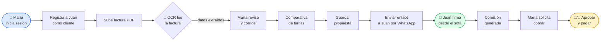

### 📖 Cómo leer este diagrama

- Cada **caja** es una **acción o pantalla**.
- Las cajas con **bordes redondeados** (las de los extremos) son **personas haciendo algo** (María inicia sesión, Juan firma…).
- La caja con forma de **rombo** es una **decisión automática** del sistema (en este caso, "el OCR lee la factura").
- Las **flechas** indican el orden: lo que está a la izquierda **pasa antes** que lo de la derecha.
- Los **colores** marcan los hitos importantes:
  - 🔵 azul: empieza el comercial
  - 🟢 verde: actúa el cliente final (la firma es el momento clave del negocio)
  - 🟡 amarillo: cierra el dinero (alguien aprueba/paga)

### 🎯 Lo importante de este diagrama

> Si entiendes este flujo, entiendes el 80% del producto. Todo lo demás (admin, RGPD, reporting…) **gira alrededor de este recorrido**.

---

# 3 · Mapa de pantallas — la estructura del edificio

La app tiene unas 25 pantallas. Para no perderte, piensa que son **tres edificios distintos**:

- 🌐 **Edificio público** (cualquiera puede entrar, como el escaparate de una tienda).
- 🏠 **Dashboard** (entran María y Roberto, con su llave personal).
- 👑 **Admin** (solo entra Carmen, con la llave maestra).

```mermaid
flowchart TB
    subgraph PUB["🌐 PÚBLICO · cualquiera puede entrar"]
        L["/<br/>Login"]
        J["/join/[code]<br/>Aceptar invitación"]
        P["/p/[token]<br/>Firmar propuesta"]
    end

    subgraph DASH["🏠 DASHBOARD · María (👤) y Roberto (🏢)"]
        D["/dashboard<br/>Inicio"]
        DC["/dashboard/clients<br/>Clientes"]
        DCI["/dashboard/clients/[id]<br/>Ficha cliente"]
        DS["/dashboard/simulator<br/>Simulador"]
        DCM["/dashboard/comparar-multiple<br/>Comparar varias"]
        DP["/dashboard/proposals<br/>Propuestas"]
        DPI["/dashboard/proposals/[id]<br/>Detalle propuesta"]
        DW["/dashboard/wallet<br/>Cartera"]
        DI["/dashboard/invoicing<br/>Facturación"]
        DN["/dashboard/network<br/>Red comercial"]
        DT["/dashboard/tariffs<br/>Tarifas"]
        DTK["/dashboard/tasks<br/>Tareas"]
        DA["/dashboard/academy<br/>Formación"]
        DAN["/dashboard/analytics<br/>Analítica"]
        DF["/dashboard/forecast<br/>Previsión"]
        DSE["/dashboard/settings<br/>Ajustes"]
    end

    subgraph ADM["👑 ADMIN · Carmen"]
        A["/admin<br/>Panel principal"]
        AA["/admin/agents<br/>Gestionar comerciales"]
        AR["/admin/reporting<br/>Informes"]
        AAU["/admin/audit<br/>Auditoría"]
        ARG["/admin/rgpd<br/>RGPD"]
    end

    L -->|si es Carmen| A
    L -->|si es María o Roberto| D
    J --> L
    DCI --> DS
    DS --> DPI
    DP --> DPI
    DPI --> P
    DN --> J

    style PUB fill:#fef9c3
    style DASH fill:#dbeafe
    style ADM fill:#fce7f3
```

### 📖 Cómo leer este diagrama

Cada **caja amarilla, azul o rosa** es un edificio entero (un grupo de pantallas que tienen algo en común). Las **cajas internas** son las pantallas concretas dentro de ese edificio.

Las **flechas** te dicen *"desde aquí puedes saltar a allá"*. Por ejemplo:

- Desde el **login** (`/`), si eres Carmen vas a `/admin`; si no, vas a `/dashboard`.
- Desde la **ficha de un cliente** (`/dashboard/clients/[id]`) puedes lanzar el **simulador** (`/dashboard/simulator`).
- Desde el **simulador** acabas en una **propuesta** (`/dashboard/proposals/[id]`).
- Desde una propuesta, María comparte un **enlace público** (`/p/[token]`) con Juan.

### 🎯 Lo importante de este mapa

> Las **pantallas públicas** son las más peligrosas: cualquiera con un enlace puede entrar. Por eso, aunque sean solo 3, son las que más vigilamos.

---

# 4 · Cómo está construida la app por dentro (sin entrar en código)

Si no eres técnico puedes saltarte esta sección, pero te ayuda a entender por qué a veces algo va lento o por qué un fallo afecta a una zona y no a otra.

**Imagina la app como un restaurante:**

| En el restaurante… | En la app es… | Para qué sirve |
|---|---|---|
| El comedor donde se sienta el cliente | 🖥 **Next.js** (las pantallas web) | Lo que ve el usuario |
| El camarero que toma nota y la lleva | ⚙️ **Server Actions** | Recoge lo que el usuario escribe y lo guarda |
| La cocina que prepara los platos | 🗄 **Supabase** (base de datos) | Guarda todos los clientes, propuestas, comisiones… |
| El altavoz que anuncia "¡pedido listo!" | 📡 **Realtime** | Avisa al instante cuando algo cambia |
| El proveedor externo que trae el pan | 🤖 **OCR externo** | Lee las facturas (no lo hacemos nosotros) |
| El reloj que arranca el lavavajillas a las 23h | ⏰ **Cron jobs** | Tareas automáticas (resumen semanal, recordatorios…) |
| La puerta de la calle para clientes que no entran | 🌐 **Rutas públicas** | Donde Juan firma sin loguearse |

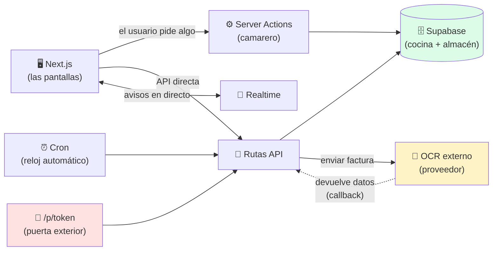

### 📖 Cómo leer este diagrama

- Las **flechas continuas** (sólidas) son comunicación directa: "te pido algo, me respondes".
- Las **flechas discontinuas** (línea de puntos) son comunicación **asíncrona**: "te aviso cuando termine, no te quedes esperando" (así funciona el OCR).
- La caja con **forma de cilindro** es la base de datos (los cilindros se usan tradicionalmente para representar bases de datos, viene de los discos duros antiguos).

### 🎯 Lo importante

> Cuando algo falla, **lo primero es localizar en qué parte del restaurante está el problema**: ¿es la pantalla? ¿el camarero? ¿la cocina? ¿el proveedor de pan? Saber esto reduce el tiempo de diagnóstico de horas a minutos.

---

# 5 · Roles y permisos — quién puede hacer qué

La app tiene una regla muy estricta: **cada uno solo ve lo suyo**. María no puede curiosear las ventas de otro comercial. Roberto solo ve a los comerciales de su zona. Carmen lo ve todo, pero no puede hacer ventas.

| Capacidad | 👑 Carmen (Admin) | 🏢 Roberto (Franquicia) | 👤 María (Agente) |
|---|:---:|:---:|:---:|
| Iniciar sesión y ver dashboard | ✅ va a `/admin` | ✅ va a `/dashboard` | ✅ va a `/dashboard` |
| Crear o importar clientes | — | (de su red) | ✅ |
| Subir factura · usar simulador | — | (según configuración) | ✅ |
| Generar propuestas | — | (según configuración) | ✅ |
| Ver propuestas de **otros** | ✅ todas | ✅ solo de su red | ❌ |
| Configurar tarifas globales | ✅ | ❌ | ❌ |
| Invitar nuevos comerciales | ✅ | ✅ a su red | ❌ |
| Aprobar / pagar retiradas | ✅ | ✅ de su red | ❌ |
| Ver auditoría / RGPD | ✅ | ❌ | ❌ |
| Ver informes globales | ✅ | parcial | ❌ |

> 🔴 **Regla de oro de seguridad.** Aunque María intente escribir a mano una URL como `/dashboard/clients/X` con el ID de un cliente que no es suyo, **la app no debe enseñarle nada**. Esto se valida en tres capas:
>
> 1. **El menú** no le muestra el enlace.
> 2. **La base de datos** (RLS) le dice "ese cliente no existe" aunque exista.
> 3. **La lógica del servidor** vuelve a comprobar que es suyo antes de responder.
>
> Tres candados en la misma puerta. Si uno falla, los otros dos protegen.

---

# 6 · Las cuatro "vidas" de los datos clave (máquinas de estado)

Algunas cosas en la app **cambian de estado a lo largo del tiempo**, como si tuvieran una vida con etapas. Conviene entender estas vidas porque la mayoría de los bugs de negocio ocurren en **transiciones mal gestionadas**.

## 6.1 La vida de un trabajo OCR

> *Cuando María sube una factura, no se procesa al instante. La factura entra en una cola, un robot la analiza, y nos avisa cuando termina.*

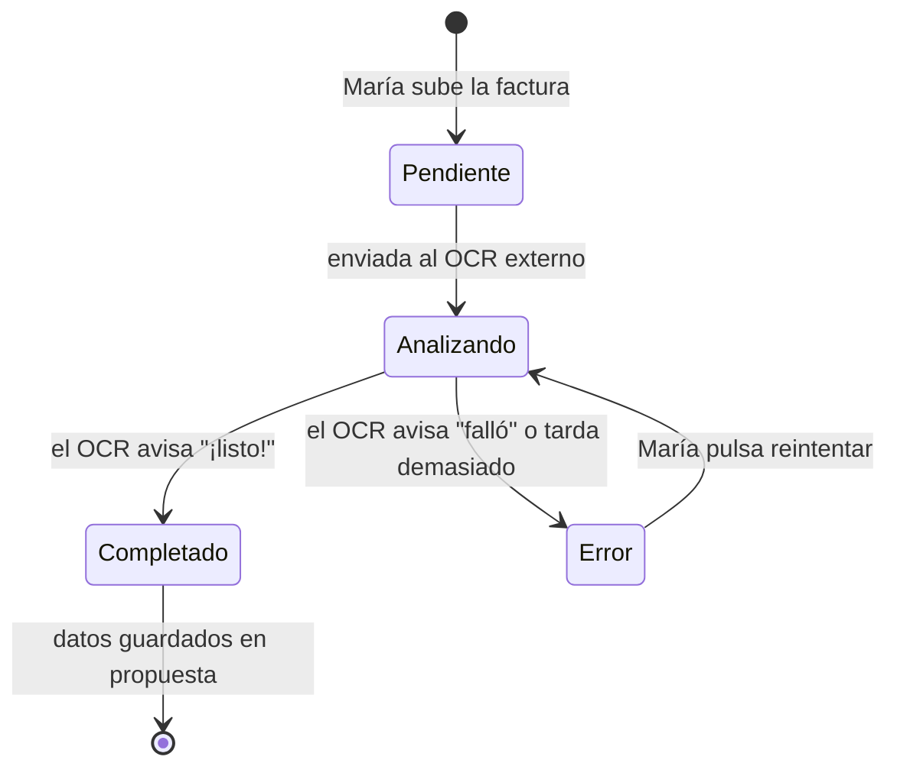

### 📖 Cómo leer este diagrama

- La caja con `[*]` es el **inicio y el final** de la vida.
- Los **rectángulos con esquinas redondeadas** son los **estados** posibles (los nombres en español).
- Las **flechas** son **transiciones** y llevan escrita la **causa** del cambio.

### 📚 Cómo se traduce esto en lo que ve María

- 🟡 **Pendiente** — María acaba de subir el PDF; la pantalla muestra "Subiendo…".
- 🟠 **Analizando** — El OCR está leyendo; la pantalla muestra un spinner: "Analizando factura…".
- 🟢 **Completado** — La pantalla muestra los datos extraídos para que María los revise.
- 🔴 **Error** — La pantalla muestra "No hemos podido leer la factura. ¿Reintentar?".

### ⚠️ Trampas

- Si el OCR no responde nunca (servicio caído), el job se queda en "Analizando" para siempre. **Tiene que haber un timeout** que pase a Error tras X minutos.
- Un job en "Error" repetido muchas veces puede indicar que el PDF está corrupto o protegido.

---

## 6.2 La vida de una propuesta

> *Una propuesta nace como borrador, se manda al cliente, y termina firmada (o caducada).*

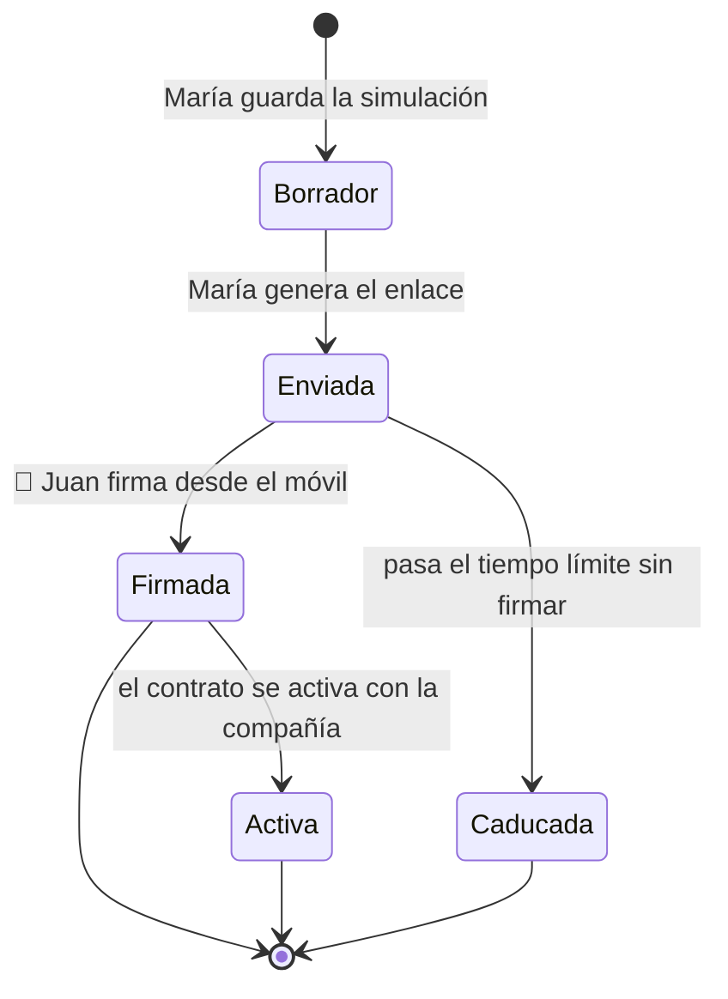

### 📚 Qué pasa en la vida real en cada etapa

- 📝 **Borrador** — María acaba de guardar, **aún no se la ha mandado a Juan**. Puede editarla.
- 📤 **Enviada** — María ha generado el enlace `/p/[token]` y se lo ha mandado a Juan. **Ya no se debería editar**.
- ✍️ **Firmada** — Juan ha estampado su firma con el dedo. La comisión se genera.
- 📜 **Activa** — La compañía ha activado el contrato. Aquí es cuando Juan empieza a ahorrar.
- ⏰ **Caducada** — Juan no firmó a tiempo. El enlace ya no funciona.

### 🎯 Lo importante

> El paso de **Enviada → Firmada** es el momento que **genera el dinero**. Por eso hay que asegurar que ese paso es robusto: si falla, María cree que ha vendido y luego no cobra.

---

## 6.3 La vida de una comisión y de una retirada

> *Esto es el dinero. Hay dos vidas paralelas: la de la comisión (que se va llenando) y la de la retirada (cuando María quiere cobrar).*

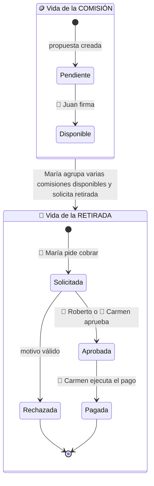

### 📚 La historia paso a paso

1. María crea una propuesta para Juan → se reserva una comisión en estado **Pendiente**.
2. Juan firma → la comisión pasa a **Disponible** (María ya puede pedirla).
3. Cuando María acumula varias comisiones disponibles, decide cobrar y **solicita una retirada**.
4. Roberto la **revisa** (¿es correcto el IBAN? ¿hay alguna anomalía?).
5. Si todo está bien, la **aprueba**. Si no, la **rechaza** con un motivo.
6. Carmen ejecuta la **transferencia bancaria** y la marca como **Pagada**.

### ⚠️ El gran riesgo

> Si María pulsa "solicitar retirada" **dos veces seguidas** (porque tarda y se pone nerviosa), no debe generarse **dos retiradas**. Esto se llama **idempotencia**. La app tiene que saber que la segunda pulsación es la misma que la primera.

---

## 6.4 La vida de una invitación

> *Cuando Roberto recluta a un nuevo comercial, le manda una invitación con un código. El código tiene una vida corta.*

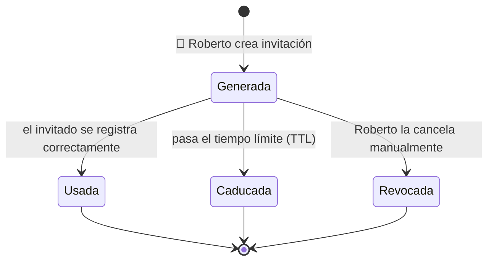

### 🎯 Lo importante

> Una vez "Usada", el código **no se puede reutilizar**. Si alguien intenta usarlo otra vez, la app responde "código ya usado". Esto evita que un mismo código sirva para colar a 10 personas falsas.

---

# 7 · Recorridos recomendados para probar la app

## 7.1 👤 Un día en la vida de María (camino comercial principal)

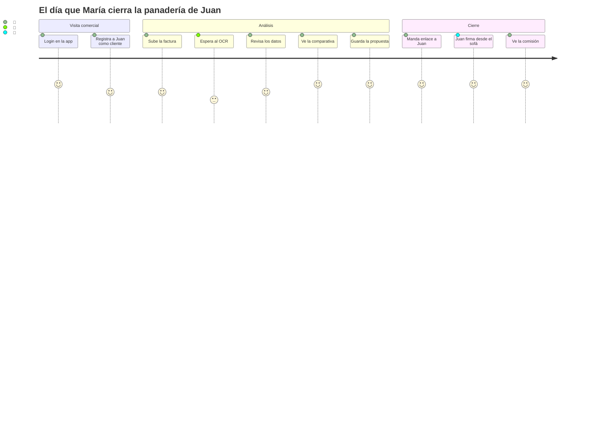

### 📖 Cómo leer este diagrama

Esto es un **"user journey"**. Cada columna es un momento del día. Los **números (3-5)** representan **lo a gusto que se siente cada actor** en ese momento (5 = encantado, 3 = un poco impaciente).

Por ejemplo, durante "Espera al OCR" María tiene un 3, porque tiene que esperar 30 segundos. No es malo, pero no es lo mejor del flujo.

### 🎯 Por qué este diagrama importa

> Nos ayuda a ver **dónde el usuario lo pasa peor** y dónde podemos mejorar la experiencia. Si el OCR pasa de 30 segundos a 5 minutos, ese 3 se convierte en 1, y María empieza a odiar la app.

---

## 7.2 🏢 Un día en la vida de Roberto

1. Login → ve el **dashboard agregado** de su zona Madrid (cuántos clientes nuevos esta semana, cuánto se ha vendido).
2. Va a `/dashboard/network` y **invita a un nuevo comercial** (Lucía).
3. Cuando Lucía se registra con el código, valida que aparece **dentro de su red**.
4. Para probar la seguridad, intenta acceder por URL a un comercial de **Sevilla** (otra franquicia) → debe **bloquearle**.

## 7.3 👑 Un día en la vida de Carmen

1. Login → es redirigida automáticamente a `/admin`.
2. Revisa **métricas globales**, atiende solicitudes RGPD, aprueba retiradas pendientes.
3. Si necesita **reconfigurar tarifas** (por ejemplo, llega una nueva oferta de Iberdrola), las edita en `/dashboard/tariffs`.

---

# 8 · Pantallas públicas — la puerta de la calle

Estas tres pantallas son **las únicas a las que puede entrar cualquier persona sin contraseña**. Por eso las miramos con lupa.

---

## 8.1 `/` — Login

📍 **Ruta:** `/` · 👥 **Quién entra:** todos · 🟡 **Riesgo:** medio (es la puerta de entrada)

### 🎯 Para qué sirve

Identificar al usuario con email y contraseña, y mandarlo al panel correcto.

### 👁 Qué se ve en pantalla

- Casilla para email.
- Casilla para contraseña.
- Botón "Entrar".
- Si te equivocas, un mensaje en rojo: "credenciales incorrectas".

### ⚙️ Qué pasa por dentro cuando pulsas "Entrar"

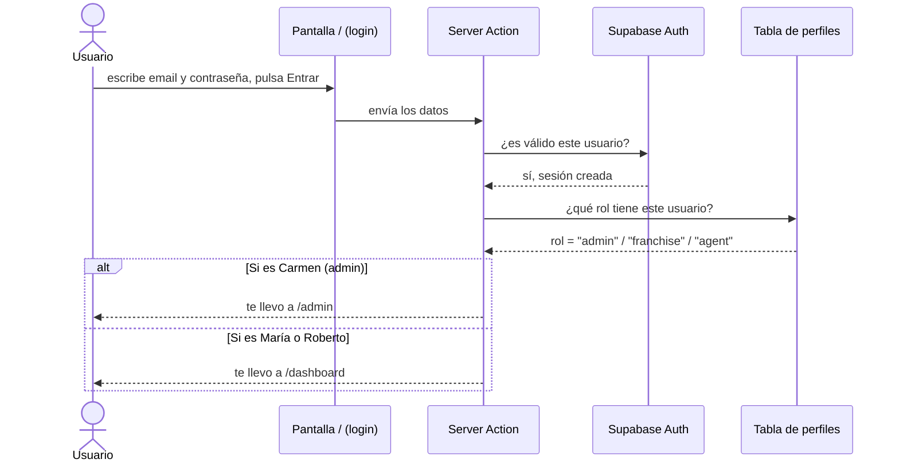

### 📖 Cómo leer este diagrama de "secuencia"

Léelo **de arriba abajo**. Cada columna vertical es un actor o un componente. Cada flecha horizontal es un mensaje que va de uno a otro:

1. **Arriba a la izquierda**: el usuario empieza el viaje.
2. Cada flecha es **una pregunta o una respuesta**.
3. La caja `alt / else` significa **"depende de quién seas"**: la app toma un camino u otro.

Es como leer un guion de teatro.

### 🧪 Cómo probarlo manualmente

| Caso | Qué tienes que ver | Por qué importa |
|---|---|---|
| ✅ Login con cada uno de los tres roles | Cada uno acaba en su panel | Comprobamos que la redirección funciona |
| ❌ Contraseña incorrecta | Mensaje genérico "credenciales incorrectas" | Si dijera "el email no existe" o "el password está mal", un atacante sabría qué emails están registrados |
| 🔒 Sin haber iniciado sesión, escribir `/dashboard` en la barra | Te manda al login | Las puertas internas tienen que estar cerradas con llave |

### ⚠️ Trampas conocidas

- **Enumeración de cuentas**: si los mensajes de error son distintos según si el email existe o no, alguien con malas intenciones puede ir probando emails y construir una lista de usuarios reales.
- **Loop de redirección**: si alguien tiene un perfil "raro" (sin rol asignado), la app puede entrar en un bucle infinito intentando llevarle a un sitio. Por eso comprobamos que **todo perfil tiene rol**.

---

## 8.2 `/join/[code]` — Registro por invitación

📍 **Ruta:** `/join/[code]` · 👥 **Quién entra:** invitado · 🟡 **Riesgo:** medio

### 🎯 Para qué sirve

Cuando Roberto invita a Lucía a su red, Lucía recibe un email con un enlace tipo `app.zinergia.com/join/X7K3M9`. Al abrirlo, Lucía puede crear su cuenta **enganchada automáticamente a la red de Roberto**.

### ⚙️ Flujo paso a paso

```mermaid
flowchart LR
    A[Lucía abre el<br/>enlace del email] --> B{¿El código<br/>es válido?}
    B -->|✓ válido| C[Formulario de registro:<br/>email + contraseña]
    B -->|✗ caducado<br/>o ya usado| X[Mensaje de error claro:<br/>"Código no válido"]
    C --> D[Lucía crea su cuenta]
    D --> E[La cuenta queda<br/>asociada a Roberto]
    E --> F[Marcamos el código<br/>como Usado]

    style X fill:#fee2e2
    style F fill:#dcfce7
```

### 📖 Cómo leer este diagrama

Las cajas con forma de **rombo** (B en este caso) son **decisiones**: la app pregunta algo y va por un camino u otro según la respuesta.

### 🧪 Cómo probarlo

| Caso | Qué tienes que ver |
|---|---|
| ✅ Lucía usa un código válido recién creado | Se registra y aparece en la red de Roberto |
| ❌ Código ya caducado (más de X días) | Mensaje claro "Código caducado, pide uno nuevo" |
| ❌ Código que alguien ya usó antes | Mensaje claro "Este código ya se ha usado" |
| 🔒 Lucía intenta usar el mismo código una segunda vez | Rechazado |

---

## 8.3 `/p/[token]` — La pantalla donde Juan firma

📍 **Ruta:** `/p/[token]` · 👥 **Quién entra:** 🧾 cliente final, sin login · 🔴 **Riesgo:** alto

### 🎯 Por qué esta pantalla es la más sensible de toda la app

Cualquiera con el enlace puede abrirla. **No hay contraseña**. Por tanto:

- El **token** debe ser largo e impredecible (como una contraseña aleatoria de 30 caracteres).
- Tiene que **caducar** después de un tiempo razonable.
- Si alguien empieza a probar tokens al azar, **debe bloquear su IP**.
- El payload de la firma (la imagen del dedo) **debe tener un tamaño máximo** (si no, alguien podría tirar abajo el servidor mandando una imagen de 1 GB).

### 👁 Qué ve Juan

1. Un **resumen de la propuesta** que le hizo María (lo que paga ahora vs. lo que pagaría).
2. Las **condiciones legales**.
3. El **ahorro estimado**.
4. Una **zona de firma** donde puede pintar con el dedo en el móvil.
5. Un **botón "Confirmar"**.

### ⚙️ Qué pasa cuando Juan firma

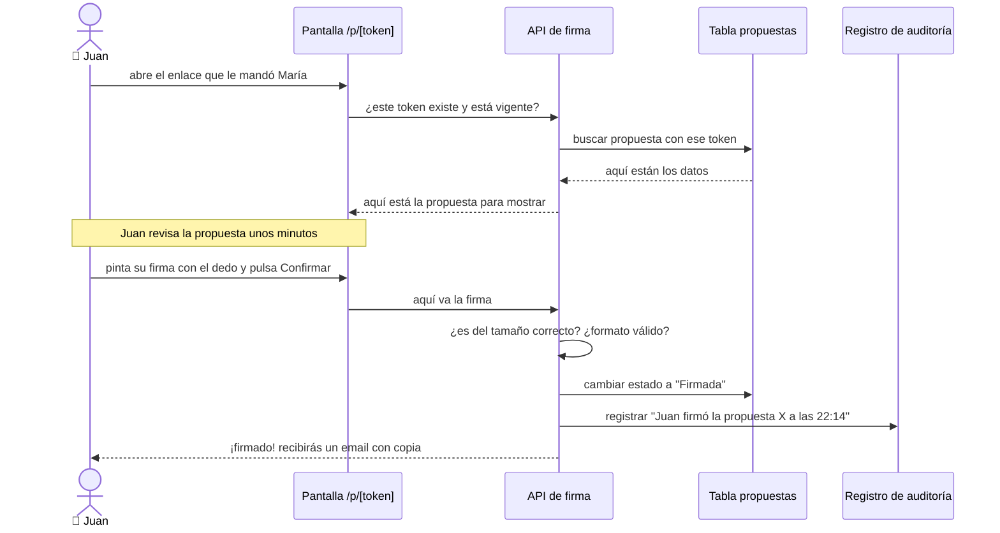

### 📖 Cómo leer las "Notas" de un diagrama de secuencia

La línea horizontal con la palabra **`Note over`** marca un **momento de pausa** o un comentario. En este caso, "Juan revisa la propuesta unos minutos" no es una acción, es solo un recordatorio de que en la vida real entre que se carga la pantalla y que Juan firma, pueden pasar varios minutos.

### 🧪 Cómo probarlo

| Caso | Qué tienes que ver |
|---|---|
| ✅ Juan abre un token recién creado y firma | Estado cambia a "Firmada", María recibe notificación |
| ❌ Token ya caducado | Mensaje claro, sin filtrar nada del interior |
| 🔒 Juan intenta firmar **dos veces** | La segunda firma no debe sobrescribir la primera silenciosamente |
| 🔒 Firma en blanco (Juan pulsa Confirmar sin pintar) | Rechazo: "tienes que firmar primero" |
| 🔒 Firma muy grande (5 MB) | Rechazo: "firma demasiado grande" |
| 🔒 Probar un token al azar (`/p/aaaaaa`) | "No existe" — y si se prueba muchas veces, bloqueo |

### ⚠️ Riesgos críticos

- **Fuga de datos:** si alguien escribe `/p/algo-aleatorio` y le sale por error la propuesta de otro cliente, eso es **una catástrofe RGPD**. El token tiene que ser **opaco** (no debe contener el ID de la propuesta).
- **Ataque de denegación de servicio:** mandar firmas de 100 MB para tirar el servidor. **Hay que limitar el tamaño**.

---

# 9 · Dashboard — el escritorio de María y Roberto

Cuando María inicia sesión, todas las pantallas del dashboard comparten una **barra superior común** con accesos rápidos a:

> **Inicio · Clientes · Propuestas · Simulador · Cartera · Red · Academy · Tarifas · Ajustes**

Vamos a recorrerlas en el orden lógico del trabajo diario.

---

## 9.1 `/dashboard` — La pantalla de inicio

📍 **Ruta:** `/dashboard` · 👥 🏢 👤 (a Carmen la redirige) · 🟢

### 🎯 Para qué sirve

Es lo primero que ven María y Roberto. Tiene que dar **información útil de un vistazo**, sin tener que clicar.

### Qué ve cada uno

| Persona | Qué ve |
|---|---|
| 👑 Carmen | Nada — la app la lleva automáticamente a `/admin` |
| 🏢 Roberto | KPIs de **toda su zona Madrid**: cuántos comerciales activos, cuántas ventas esta semana, conversión, comisiones pendientes |
| 👤 María | KPIs **personales**: sus clientes nuevos, sus propuestas en marcha, sus comisiones, alertas, y los OCR jobs recientes |

### 🧪 Qué probar

- 🔒 Si Carmen abre `/dashboard` a mano, debe ir a `/admin`.
- 🔒 María solo ve **sus** datos. Roberto solo ve los de **su zona**.
- ✅ Cuando un usuario es nuevo y no tiene datos, **los gráficos vacíos no parecen rotos** (deben tener un mensaje tipo "todavía no tienes clientes, empieza creando uno").

---

## 9.2 `/dashboard/clients` — La cartera de clientes

📍 **Ruta:** `/dashboard/clients` · 👥 🏢 👤 · 🟡 (contiene datos personales)

### 🎯 Para qué sirve

Es la "agenda" de María. Aquí ve todos sus clientes (panaderos, peluqueros, oficinas…) con su estado.

### 👁 Qué se ve

- **Listado** de clientes con nombre, contacto, último estado.
- **Buscador** por nombre o CUPS.
- **Filtros** por estado ("nuevo", "en proceso", "firmado", "perdido").
- **Vista de pipeline** (estilo trello): columnas por estado, tarjetas arrastrables.
- **KPIs**: total de clientes, conversión.
- **Botones**: nuevo cliente, importar CSV, acciones masivas.

### Sub-flujo: dar de alta a Juan a mano

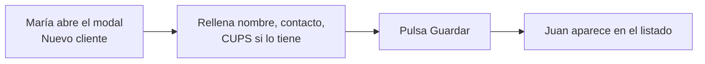

### Sub-flujo: importar 50 clientes desde un Excel

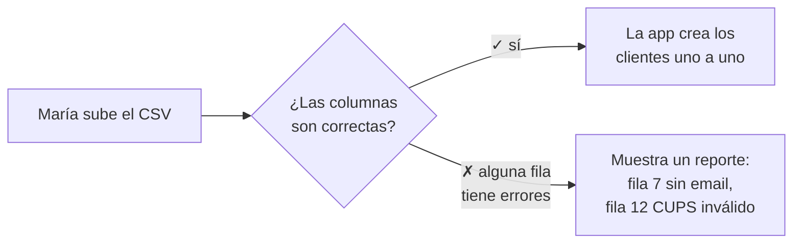

### 💾 Datos sensibles que se guardan aquí

- Nombre, email, teléfono, dirección.
- **CUPS** (la "matrícula" del suministro).
- **DNI o CIF** si es autónomo.

> 🔒 **Importante.** El CUPS y el DNI se guardan **cifrados**. Si alguien con acceso técnico mira la base de datos directamente, no debería leer "12345678A" sino algo ilegible.

### 🧪 Qué probar

| Caso | Esperado |
|---|---|
| ✅ Crear cliente con datos mínimos (solo nombre y teléfono) | Aparece en el listado |
| ✅ Importar un CSV correcto de 100 filas | Crea 100 clientes |
| ✅ Importar un CSV con 5 filas mal | Crea las correctas y muestra reporte de las 5 erróneas |
| 🔒 María intenta abrir un cliente de **Pedro** (otro comercial) escribiendo la URL a mano | Bloqueo: "no encontrado" |
| 🔒 Provocar un error técnico | El error **no** muestra el CUPS ni el DNI en el mensaje |

---

## 9.3 `/dashboard/clients/[id]` — La ficha completa de un cliente

📍 **Ruta:** `/dashboard/clients/[id]` · 👥 🏢 👤 · 🟡

### 🎯 Para qué sirve

Es la **vista 360°** de Juan. María llega aquí cuando hace clic sobre Juan en la lista.

### 👁 Qué se ve

- 🏷 **Cabecera**: nombre, datos de contacto, estado comercial.
- 📋 **Propuestas** que María le ha mandado (con su estado).
- 🧾 **Histórico de facturas** que ha subido.
- 📅 **Timeline** de actividad (qué se ha hecho con este cliente, ordenado por fecha).
- ✅ **Tareas** pendientes ("llamar el viernes para confirmar firma").
- 📁 **Documentos** y contratos.

### Acciones típicas

| Acción | Qué pasa |
|---|---|
| ✏️ Editar | Cambia los datos del cliente y refresca la pantalla |
| 🚀 **Simular** | Lleva al simulador con los datos de Juan ya cargados (no hay que escribirlos otra vez) |
| 🗑 Eliminar | Pide confirmación; al borrar, no debe dejar propuestas o documentos "huérfanos" sin sentido |

---

## 9.4 `/dashboard/simulator` — El simulador OCR (el corazón de la app)

📍 **Ruta:** `/dashboard/simulator` · 👥 👤 (🏢 según configuración) · 🔴 **Núcleo del producto**

### 🎯 Por qué esta pantalla es la más importante

> **Si esta pantalla falla, la app no sirve para nada.** Aquí es donde sucede la magia: el PDF se convierte en una propuesta firmable.

### El proceso en 5 etapas

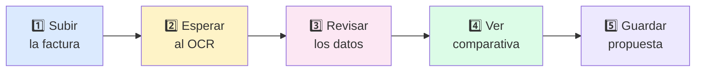

> **Tip de lectura.** Cada color representa un "ánimo" de María: azul (acción rápida), amarillo (espera), rosa (concentración revisando), verde (descubrimiento del ahorro), morado (cierre).

### 1️⃣ Subida

- María arrastra el PDF a una zona o lo selecciona desde su disco.
- Si está habilitado el modo "batch", puede subir varias facturas a la vez.
- La app valida: ¿es PDF? ¿pesa menos de X MB? Si no, error claro.

### 2️⃣ El OCR (la parte que más confunde)

Esta es la etapa más complicada técnicamente. Vamos a verla paso a paso:

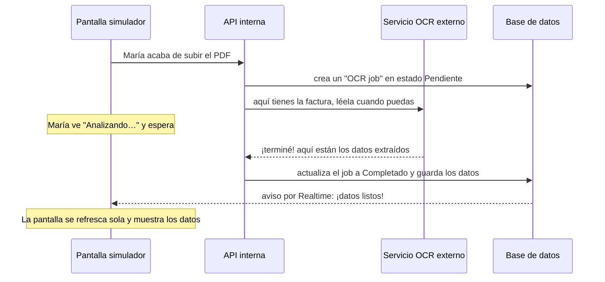

#### 📖 Cómo leer este diagrama

- Mira las **líneas verticales con cabecera**: cada una es un componente diferente.
- Las **flechas** van de un componente a otro.
- Las **flechas continuas** (`->>`) son peticiones síncronas: "te pregunto y espero respuesta".
- Las **flechas con punta abierta** (`-->>`) son respuestas o avisos asíncronos.
- Las **notas grises** son cosas que pasan en paralelo (María esperando, la pantalla refrescándose).

#### Lo importante a entender

> **El OCR no es instantáneo**. María sube el PDF, pero los datos no aparecen al segundo. Pueden pasar 15 segundos, 1 minuto o, si hay problemas, varios minutos. La app **no se queda colgada** esperando: te dice "estoy en ello" y te avisa cuando termina.

### 3️⃣ Revisión de datos

Cuando el OCR termina, María ve los datos extraídos junto al PDF original. Tiene que comprobar:

- **Titular**: ¿pone "Juan García" o "Juana García"?
- **CUPS**: ¿ha leído bien los 20 caracteres?
- **Dirección de suministro**: ¿el OCR ha leído "Calle Mayor 5" o "Calle Mayor 8"?
- **Potencia contratada**: ¿4,6 kW o 6,9 kW?
- **Consumo**: ¿ha leído los kWh de cada periodo?
- **Tarifa actual**: ¿es 2.0TD?
- **Importe**: ¿qué pagó?

> 💡 **Por qué esta etapa es crítica.** Si el OCR se confunde con un dígito del consumo, la comparativa de tarifas estará mal y María le venderá a Juan algo equivocado. **María tiene que poder corregir antes de continuar.**

### 4️⃣ Comparativa

La app muestra:

- **Lo que paga ahora** vs. **lo que pagaría con cada alternativa**.
- **Ahorro estimado** anual con cada opción.
- **Recomendaciones** ("esta es la mejor para tu perfil").
- **Tarjetas visuales** que se pueden enseñar a Juan en pantalla.
- Botones de **exportar a PDF** o **modo presentación**.

### 5️⃣ Guardar la propuesta

María elige la opción ganadora y pulsa "Guardar". La propuesta queda asociada a Juan, a María y al CUPS, y ya se puede compartir vía `/p/[token]`.

### 🧪 Qué probar

| Caso | Esperado |
|---|---|
| ✅ Subir un PDF de factura real, bien escaneado | OCR completa y datos correctos |
| ❌ Subir un archivo que no es factura (un selfie, un Word) | Error claro: "no parece una factura" |
| ❌ El OCR no responde (servicio caído) | La app **no se queda colgada**: muestra estado de error tras unos minutos |
| ✅ María corrige un dato del OCR antes de guardar | El cambio se conserva |
| 🔒 Los datos enviados al "entrenamiento" del OCR van **sin nombre, sin CUPS y sin DNI** | Sí, sanitizados |
| 🔒 María pulsa "Guardar" dos veces seguidas (porque tarda) | **Una sola propuesta**, no dos duplicadas |

---

## 9.5 `/dashboard/comparar-multiple` — Comparar varias facturas a la vez

📍 **Ruta:** `/dashboard/comparar-multiple` · 👥 👤 · 🟡

### 🎯 Para qué sirve

Algunos clientes (oficinas, cadenas pequeñas) tienen **varios suministros**. María puede subir hasta **3 facturas a la vez** y comparar.

### Estados que pasa cada factura

`Pendiente → Analizando → Analizada → Comparando → Completada` (o `Error` si algo falla).

### 🧪 Qué probar

- ✅ Subir 1, 2 y 3 facturas funcionan.
- ❌ Intentar subir 4 → rechazado.
- 🔒 **Si una factura falla, las demás siguen su curso** (no se cae todo el flujo).
- 🔒 **Cada resultado corresponde a su factura** (no se cruzan los datos).

---

## 9.6 `/dashboard/proposals` — El listado de propuestas

📍 **Ruta:** `/dashboard/proposals` · 👥 todos · 🟡

### 🎯 Para qué sirve

Aquí están **todas las propuestas** que María (o Roberto, o Carmen) ha generado. Como un correo pero solo para propuestas.

### Qué se ve

- Listado, búsqueda, filtros por estado, ordenación por fecha o por importe.

### 🧪 Qué probar

- 🔒 María solo ve las **suyas**.
- 🔒 Roberto solo ve las de **su zona**.
- 🔒 Carmen ve todas, pero según los permisos de gestión.
- ✅ Aplicar varios filtros a la vez no rompe la paginación.

---

## 9.7 `/dashboard/proposals/[id]` — El detalle de una propuesta

📍 **Ruta:** `/dashboard/proposals/[id]` · 👥 todos · 🔴 (genera PDFs con datos personales)

### 🎯 Para qué sirve

Cuando María hace clic en una propuesta del listado, llega aquí. Puede revisar los datos, **generar el PDF**, **copiar el enlace público** (`/p/[token]`) y consultar si Juan ya firmó.

### Una ruta API que vigilar: `/api/proposal/[id]/pdf`

Esa URL es la que **genera el PDF**. Es muy delicada porque el PDF contiene datos sensibles de Juan.

> 🔒 **Reglas que tiene que cumplir esa URL:**
>
> - Solo María puede descargar **sus** PDFs.
> - Roberto solo los de **su zona**.
> - **No basta con la seguridad de la base de datos (RLS)**: la URL debe volver a comprobar a quién pertenece el PDF antes de generarlo.

### 🧪 Qué probar

- ✅ María descarga el PDF de Juan: OK.
- 🔒 María intenta poner en la URL el ID de una propuesta de otro comercial: bloqueo.
- 🔒 El PDF generado **nunca contiene datos** de otra propuesta por error.

---

## 9.8 `/dashboard/wallet` — La cartera (donde está el dinero)

📍 **Ruta:** `/dashboard/wallet` · 👥 todos (vistas distintas) · 🔴 **Riesgo alto: aquí se mueve dinero**

### 🎯 Para qué sirve

Es donde María ve cuánto ha ganado y pide cobrar.

### Lo que ve María

- 🪙 **Comisiones disponibles** (las que ya puede pedir).
- ⏳ **Comisiones pendientes** (clientes que aún no han firmado).
- 📊 **Histórico** de retiradas anteriores.
- 🏦 **Su IBAN** (cuenta bancaria donde cobra).
- 🔘 Botón **"Solicitar retirada"**.

### Lo que ven Roberto y Carmen

- Las comisiones de **su red** (Roberto) o **globales** (Carmen).
- Solicitudes pendientes de aprobación.
- Botones para **aprobar, rechazar, marcar como pagada**.
- Exportación a CSV.

### El flujo completo de una retirada

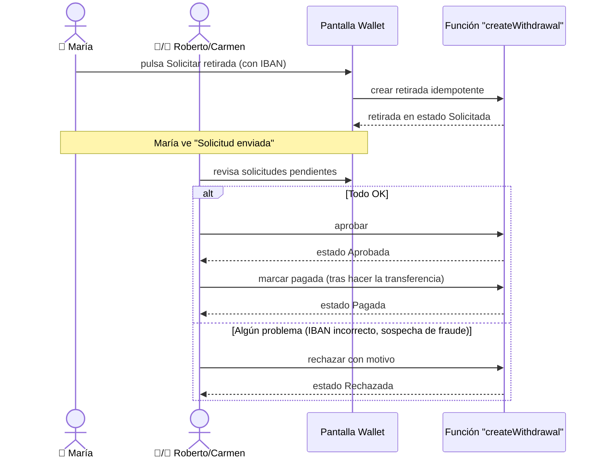

### 📖 Cómo leer este diagrama

- Hay **dos actores humanos**: María y Roberto/Carmen.
- La caja `alt / else` es una **bifurcación**: o todo va bien (camino "alt") o hay un problema (camino "else"). Solo se sigue una de las dos.

### 🔒 Reglas críticas

- 👤 María solo ve **sus** retiradas.
- 🏢 Roberto solo ve las de **su red**.
- 👑 Carmen ve todas.
- La función "createWithdrawal" debe ser **idempotente**: si María pulsa el botón **dos veces**, no se generan dos retiradas (esto es vital, hablamos de dinero).

---

## 9.9 a 9.16 — El resto del dashboard

Estas pantallas son secundarias. Aquí van con menos detalle porque no son flujos críticos.

| Pantalla | Para qué sirve | Qué vigilar |
|---|---|---|
| **9.9** `/dashboard/invoicing` | Emitir facturas asociadas a comisiones | Permisos por rol |
| **9.10** `/dashboard/network` | Ver el árbol jerárquico de la red, invitar agentes | Que Roberto no invite fuera de su zona; que el árbol no mezcle franquicias |
| **9.11** `/dashboard/tariffs` | Consultar tarifas eléctricas y de gas | Que María no las pueda modificar; que cambios afectan **nuevas** simulaciones |
| **9.12** `/dashboard/tasks` | Mini-CRM de tareas pendientes | María no ve tareas ajenas |
| **9.13** `/dashboard/academy` | Cursos de formación | Estado vacío legible |
| **9.14** `/dashboard/analytics` | Métricas comerciales (funnel, conversión, tendencias) | Coherencia con `/dashboard` |
| **9.15** `/dashboard/forecast` | Previsión de ventas y renovaciones | Cálculos no rompen sin históricos |
| **9.16** `/dashboard/settings` | Editar perfil, datos comerciales, comisiones | Permisos por rol |

---

# 10 · Panel de administración (solo Carmen)

📍 **Ruta:** `/admin/*` · 👥 solo 👑 · 🔴 **Cualquier otro rol → bloqueo o redirección**

> **Imagina** este panel como la oficina del director del banco. Solo Carmen tiene la llave.

| Ruta | Para qué sirve | Qué probar |
|---|---|---|
| `/admin` | Resumen global de la empresa | Solo Carmen entra; estados vacíos OK |
| `/admin/agents` | Gestionar a todos los comerciales | Cambios de asignación; sin datos personales innecesarios |
| `/admin/reporting` | Informes y rankings | Filtros de fecha; coherencia con comisiones |
| `/admin/academy` | Gestionar contenido formativo | Crear, editar, publicar |
| `/admin/audit` | Registro de eventos sensibles | El registro **no guarda nombres ni emails completos** |
| `/admin/business-metrics` | Métricas avanzadas | Consistencia con reporting |
| `/admin/rgpd` | Exportar o borrar datos personales | Ver flujo dedicado abajo |

## 10.1 El flujo RGPD — el más sensible de todo el panel admin

> **Ejemplo real.** Juan llama y dice: "Quiero que borréis todos mis datos". Por ley, Carmen tiene que poder hacerlo en pocos días.

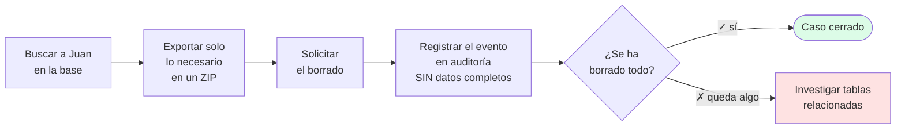

### 🎯 Por qué importa

> Si Juan ha pedido el borrado y al mes Carmen sigue viendo su email en algún sitio, **Zinergia incumple la ley** y se expone a multas. Por eso el flujo termina con una verificación.

---

# 11 · Procesos automáticos y APIs internas

Hay cosas que pasan en la app **sin que nadie pulse un botón**:

| Ruta interna | Cuándo se ejecuta | Por qué hay que vigilarla |
|---|---|---|
| `/api/webhooks/ocr/callback` 🔴 | Cuando el OCR externo termina | Tiene que validar que el aviso es real y no un atacante imitando al OCR |
| `/api/proposal/[id]/pdf` 🔴 | Cuando alguien descarga un PDF | Debe comprobar que es **suyo** |
| `/api/cron/detect-renewals` 🔴 | Cada noche, automático | Detecta clientes a los que se les acaba el contrato |
| `/api/cron/proposal-followup` 🔴 | Cada día, automático | Manda recordatorio a clientes que no han firmado |
| `/api/cron/weekly-summary` 🔴 | Cada lunes a las 8h | Manda resumen semanal a comerciales |
| `/api/cron/purge-expired-clients` 🔴 | Cada noche | Borra datos antiguos según RGPD |

> 🔒 **Regla crítica para los cron**: si por error se ejecutan dos veces el mismo día, **el resultado debe ser el mismo que ejecutarlos una vez** (idempotencia). Si no, podría pasar que un cliente reciba dos emails de recordatorio el mismo día, o que se borre un dato dos veces.

---

# 12 · Las 6 reglas transversales que aplican siempre

| # | Regla | Por qué importa |
|:---:|---|---|
| 1 | Todo acceso a la base pasa por **RLS** | Es el primer candado contra fugas de datos |
| 2 | Las funciones que **escriben** datos validan el rol antes | Defensa en profundidad: si RLS falla, este es el segundo candado |
| 3 | **CUPS y DNI/CIF** se cifran y se buscan por hash | Si alguien roba la base, no lee los datos personales |
| 4 | **Logs sin datos personales** | Los registros técnicos no deben contener nombres, emails ni DNIs |
| 5 | `database.types.ts` **regenerado** tras cada migración | Para que el código siempre conozca el esquema actual |
| 6 | Toda modificación de esquema vive en `supabase/migrations/` | Para tener historial y poder revertir si algo sale mal |

---

# 13 · Checklist universal para cada pantalla

Cuando vayas a probar **cualquier pantalla**, recorre esta lista:

```
🟦 FUNCIONAL
  ☐ Carga bien con datos normales
  ☐ Carga bien sin datos (estado vacío legible, no roto)
  ☐ Las acciones principales funcionan
  ☐ Si recargo la pantalla, los cambios persisten
  ☐ Si pulso atrás, vuelvo a un sitio lógico

🟥 SEGURIDAD
  ☐ El rol correcto puede entrar
  ☐ Un rol incorrecto NO puede entrar (ni escribiendo la URL)
  ☐ No se ven datos cruzados entre usuarios
  ☐ Los botones críticos no permiten doble envío
  ☐ Los mensajes de error no revelan datos sensibles

🟨 UX (EXPERIENCIA)
  ☐ Los errores son comprensibles para un humano
  ☐ En móvil, la pantalla no se rompe
  ☐ Los estados vacíos no parecen errores
  ☐ Funciona con teclado (sin ratón)
  ☐ Los textos tienen contraste suficiente
```

---

# 14 · Las 5 pruebas E2E que recomendamos

E2E significa "end-to-end" — pruebas que recorren un flujo **completo**, como lo haría un usuario real, sin saltarse nada.

### 🥇 E2E 1 — Una venta completa

> Login María → crea cliente → sube factura → revisa OCR → guarda propuesta → genera PDF → comparte enlace → Juan firma → comprobamos comisión.

### 🥈 E2E 2 — Roberto recluta y supervisa

> Login Roberto → crea invitación → Lucía se registra con el código → aparece en la red → Roberto **no** puede ver los datos de otra zona.

### 🥉 E2E 3 — Cobrar una retirada

> Login María → ve comisión disponible → solicita retirada → Login Roberto → aprueba → Login Carmen → marca pagada → vuelve María y ve "Pagada".

### 🛡 E2E 4 — Cumplir RGPD

> Login Carmen → busca a un cliente → exporta sus datos → ejecuta borrado → confirma que ya no aparece en ningún sitio → revisa el audit log.

### 🚨 E2E 5 — Acceso cruzado (la prueba de seguridad)

> Crear dos comerciales A y B. A genera datos. Entrar como B y forzar las URLs de A. **Debe bloquear todo**: clientes, propuestas, PDFs, comisiones, retiradas.

---

# 15 · Pendientes de validación

Cosas que aún no hemos verificado en un entorno de producción real:

- ⏳ Ejecutar las 5 pruebas E2E con datos reales en staging.
- ⏳ Confirmar que en móvil las pantallas densas (clientes, simulador, red, wallet, admin) se ven bien.
- ⏳ Verificar la **idempotencia** real de los cron en producción (¿qué pasa si se duplican?).
- ⏳ Validar el formato comercial final de los PDFs.
- ⏳ Cerrar con negocio los **estados exactos** de propuesta, comisión y retirada.
- ⏳ Decidir si el **nombre completo** y la **dirección** deben cifrarse también (ahora solo se cifran CUPS y DNI).

---

# 🧭 Orden recomendado para revisar la app por primera vez

```mermaid
flowchart LR
    A[1️⃣ Login y permisos] --> B[2️⃣ Clientes]
    B --> C[3️⃣ Simulador OCR]
    C --> D[4️⃣ Propuestas y PDF]
    D --> E[5️⃣ /p/token y firma]
    E --> F[6️⃣ Wallet y retiradas]
    F --> G[7️⃣ Red e invitaciones]
    G --> H[8️⃣ Tarifas]
    H --> I[9️⃣ Admin y reporting]
    I --> J[🔟 RGPD y auditoría]
    J --> K[1️⃣1️⃣ Cron y webhooks]
    K --> L[1️⃣2️⃣ Responsive móvil]
```

> Hemos puesto este orden a propósito: empezamos por lo que más usa el comercial y dejamos para el final lo automático. Si los flujos base están rotos, los cron y la auditoría no importan.

---

---

# 📎 Anexo A — Queries SQL de verificación (para técnicos)

> Estas consultas las ejecuta alguien con acceso a Supabase. Sirven para verificar manualmente que todo funciona.
>
> Importante: son consultas de apoyo para staging o para una revisión controlada. Antes de ejecutarlas en producción, confirma que el esquema remoto coincide con `src/types/database.types.ts` y ajusta nombres de columnas si una migración posterior los ha cambiado.

## A.1 Salud general del entorno

```sql
SELECT 'profiles'      AS tabla, count(*) FROM profiles
UNION ALL SELECT 'clients',           count(*) FROM clients
UNION ALL SELECT 'proposals',         count(*) FROM proposals
UNION ALL SELECT 'ocr_jobs',          count(*) FROM ocr_jobs
UNION ALL SELECT 'network_commissions', count(*) FROM network_commissions
UNION ALL SELECT 'withdrawal_requests', count(*) FROM withdrawal_requests
UNION ALL SELECT 'invitations',       count(*) FROM invitations
ORDER BY tabla;
```

## A.2 Roles y onboarding

```sql
-- Distribución de roles
SELECT role, count(*) FROM profiles GROUP BY role ORDER BY count(*) DESC;

-- Perfiles huérfanos (causan loop de redirección al loguear)
SELECT id, email FROM profiles WHERE role IS NULL;

-- Agentes sin franquicia asignada
SELECT id, email FROM profiles WHERE role = 'agent' AND franchise_id IS NULL;
```

## A.3 Aislamiento de datos por agente / franquicia

```sql
-- Clientes que un agente debería ver
SELECT count(*) FROM clients WHERE owner_id = :agent_id;

-- 🔒 Comprobación de fuga: clientes visibles para B que pertenecen a A
SELECT c.id FROM clients c
WHERE c.owner_id = :agent_a_id
  AND c.id IN (SELECT id FROM clients WHERE owner_id = :agent_b_id);

-- Propuestas de una franquicia
SELECT id, status, created_at
FROM proposals
WHERE franchise_id = :franchise_id
ORDER BY created_at DESC;
```

## A.4 Pipeline OCR

```sql
-- Jobs por estado en las últimas 24h
SELECT status, count(*) FROM ocr_jobs
WHERE created_at > now() - interval '24 hours'
GROUP BY status;

-- 🟥 Jobs zombi (en "Analizando" más de 10 min)
SELECT id, created_at, updated_at FROM ocr_jobs
WHERE status = 'analyzing' AND updated_at < now() - interval '10 minutes';

-- 🔒 PII en ejemplos de entrenamiento (no debe haber CUPS visibles)
SELECT id, created_at FROM ocr_training_examples
WHERE raw_fields::text ~* '(ES[0-9A-Z]{16,20})'
   OR extracted_fields::text ~* '(ES[0-9A-Z]{16,20})'
   OR corrected_fields::text ~* '(ES[0-9A-Z]{16,20})'
   OR raw_text_sample ~* '(ES[0-9A-Z]{16,20})';
```

## A.5 Comisiones y retiradas

```sql
-- Comisiones disponibles por agente
SELECT agent_id, sum(agent_commission) AS disponible
FROM network_commissions
WHERE status = 'available'
GROUP BY agent_id
ORDER BY disponible DESC;

-- Retiradas pendientes
SELECT w.id, w.amount, w.created_at, p.email
FROM withdrawal_requests w
JOIN profiles p ON p.id = w.user_id
WHERE w.status = 'requested'
ORDER BY w.created_at;

-- 🔒 Detección de duplicados (debería ser idempotente)
SELECT user_id, amount, count(*)
FROM withdrawal_requests
WHERE created_at > now() - interval '5 minutes'
GROUP BY user_id, amount
HAVING count(*) > 1;
```

## A.6 Propuestas y firma pública

```sql
SELECT status, count(*) FROM proposals
WHERE created_at > now() - interval '7 days' GROUP BY status;

-- 🔒 Tokens públicos vivos
-- PENDIENTE: confirmar en el entorno remoto si estas columnas public_* ya forman parte
-- de la migración aplicada. El código de propuesta pública las usa.
SELECT id, public_token, public_expires_at FROM proposals
WHERE public_token IS NOT NULL
  AND (public_expires_at IS NULL OR public_expires_at > now());

-- Propuestas aceptadas por enlace público
SELECT id, public_accepted_at, signed_at, signed_name
FROM proposals
WHERE public_accepted_at IS NOT NULL
ORDER BY public_accepted_at DESC;
```

## A.7 Auditoría y RGPD

```sql
SELECT action, count(*) FROM audit_logs
WHERE created_at > now() - interval '1 day'
GROUP BY action ORDER BY count(*) DESC;

-- 🔒 PII en audit log (no debería)
SELECT id, action, created_at FROM audit_logs
WHERE old_data::text ~* '@'
   OR new_data::text ~* '@'
   OR old_data::text ~* '\m[0-9]{8}[A-Z]\M'
   OR new_data::text ~* '\m[0-9]{8}[A-Z]\M';
```

---

# 🚑 Anexo B — Runbook: qué hacer si algo falla

Cuando algo se rompe, sigue este formato: **síntoma → diagnóstico → mitigación**.

## B.1 🔴 El OCR no completa

**Síntoma.** El simulador queda en "Analizando" indefinidamente.

**Diagnóstico**

1. Ver `ocr_jobs` con `status = 'analyzing'` más de 10 min (query A.4).
2. Revisar logs del callback `/api/webhooks/ocr/callback` en Vercel.
3. Verificar si el servicio OCR externo está caído.

**Mitigación**

| Caso | Acción |
|---|---|
| OCR externo caído | Avisar a usuarios; reintentar cuando vuelva |
| Callback rechazado por firma inválida | Rotar/sincronizar el secret del webhook |
| Job concreto bloqueado | `UPDATE ocr_jobs SET status = 'error' WHERE id = ...` y pedir al usuario que reintente |

## B.2 🔴 El cliente firma y no se actualiza el estado

**Diagnóstico.** Revisar la fila de `proposals`: estado, `public_accepted_at`, `signed_at`, `signed_name` y `signature_data` si esas columnas existen en el entorno. Revisar logs. Comprobar canal Realtime.

**Mitigación.** Si la firma existe pero el estado no cambió: transición manual + audit log. Si no existe: revisar tamaño/formato del payload.

## B.3 🔴 Doble retirada por el mismo agente

**Síntoma.** El agente ve dos retiradas pendientes con el mismo importe.

**Diagnóstico.** Query A.5 de duplicados. Revisar si la RPC usa `request_id` único.

**Mitigación.** Cancelar el duplicado más reciente con motivo "duplicado". Abrir incidencia técnica para reforzar idempotencia.

## B.4 🔴 Acceso cruzado entre agentes

**🚨 STOP.** No empujar más cambios hasta cerrar la fuga.

1. Ejecutar query 🔒 de A.3.
2. Auditar logs por `client_id` afectado.
3. Notificar a Seguridad/RGPD si hubo lectura efectiva.
4. Endurecer RLS y añadir test de regresión.

## B.5 🟡 PDF de propuesta vacío o cruzado

Verificar ownership en la ruta API. Añadir `Cache-Control: private, no-store`. Invalidar caché y regenerar.

## B.6 🟡 Cron ejecutado dos veces

Añadir advisory lock o columna `idempotency_key`. Limpiar duplicados con cuidado, manteniendo el primero.

## B.7 🟡 Login en bucle

Query A.2 de perfiles huérfanos. `UPDATE profiles SET role = 'agent' WHERE id = :user_id`. Revisar el flujo de alta para que siempre asigne rol.

## B.8 🟢 Estados vacíos parecen errores

Cada listado debe tener un estado vacío explícito con icono + texto + CTA. No es bloqueante pero degrada la primera impresión.

---

# 📸 Anexo C — Slots para capturas de pantalla

| Pantalla | Fichero sugerido | Estado |
|---|---|:---:|
| Login `/` | `docs/screens/login.png` | ⬜ |
| Dashboard agente | `docs/screens/dashboard-agent.png` | ⬜ |
| Dashboard franquicia | `docs/screens/dashboard-franchise.png` | ⬜ |
| Listado clientes | `docs/screens/clients-list.png` | ⬜ |
| Ficha cliente | `docs/screens/client-detail.png` | ⬜ |
| Simulador — Subida | `docs/screens/sim-1-upload.png` | ⬜ |
| Simulador — OCR | `docs/screens/sim-2-ocr.png` | ⬜ |
| Simulador — Revisión | `docs/screens/sim-3-review.png` | ⬜ |
| Simulador — Comparativa | `docs/screens/sim-4-compare.png` | ⬜ |
| Detalle de propuesta | `docs/screens/proposal-detail.png` | ⬜ |
| Propuesta pública firma | `docs/screens/p-token-sign.png` | ⬜ |
| Wallet agente | `docs/screens/wallet-agent.png` | ⬜ |
| Wallet aprobación | `docs/screens/wallet-approve.png` | ⬜ |
| Red comercial | `docs/screens/network-tree.png` | ⬜ |
| Admin panel | `docs/screens/admin-home.png` | ⬜ |
| Admin RGPD | `docs/screens/admin-rgpd.png` | ⬜ |

**Cómo insertar una captura**

```markdown

```

> Resoluciones recomendadas: ≈1280×800 desktop, 390×844 móvil.

---

# 🖨 Versión imprimible

Existe una **versión HTML optimizada para impresión** en [`FLUJOS_OPERATIVOS_APP_PRINT.html`](./FLUJOS_OPERATIVOS_APP_PRINT.html).

**Cómo generar el PDF** (paso a paso):

1. Abre el archivo HTML en **Chrome** o **Edge** (doble clic).
2. **Espera 3-5 segundos** a que carguen los diagramas.
3. Pulsa `Ctrl + P` (Windows) o `Cmd + P` (Mac).
4. En **Destino**, elige **"Guardar como PDF"**.
5. **Tamaño**: A4. **Márgenes**: predeterminado o mínimos. **Gráficos de fondo**: activado.
6. Pulsa **Guardar**.

> Si los diagramas no se ven dibujados, espera más tiempo o revisa que el navegador tiene internet (los diagramas se cargan desde una librería online).
