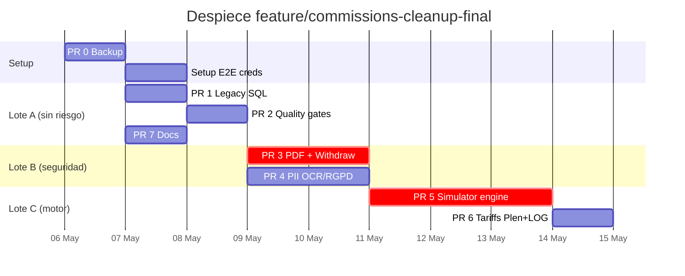

# 🗺 Plan de implementación — despiece de `feature/commissions-cleanup-final`

> **Contexto.** En la rama `feature/commissions-cleanup-final` hay **96 archivos sin commitear** mezclando 5 dominios (seguridad, motor de cálculo, tarifas, UI, docs). Este plan despieza ese trabajo en **7 PRs reviewables y revertibles por separado**, en orden de menor a mayor riesgo.
>
> **Autor del plan.** Auditoría 2026-05-05.
> **Estado inicial verificado.** TypeScript ✓ · Lint ✓ · Tests 183 ✓ · Build ✓ · E2E ❌ no ejecutados.

---

## 📋 Resumen ejecutivo

| # | PR | Archivos | Riesgo | Tiempo | Bloquea a |
|:-:|---|:-:|:-:|:-:|:-:|
| 0 | Pre-flight & backup | 0 | 🟢 | 15 min | TODO |
| 1 | `chore: archive legacy SQL + commit audit doc` | ~40 | 🟢 | 30 min | 2-7 |
| 2 | `fix: stabilize audit quality gates` | ~6 | 🟢 | 30 min | 3-6 |
| 3 | `fix(security): scope PDF + withdrawals RLS` | ~6 | 🔴 | 2 h + E2E | 5,6 |
| 4 | `fix(security): minimize PII in OCR + RGPD logs` | ~10 | 🟡 | 1 h | — |
| 5 | `feat(simulator): comparison engine + supervised flow` | ~25 | 🔴 | 3 h + E2E | 6 |
| 6 | `feat(tariffs): Plenitude + LOGOS + marketer logos` | ~20 | 🟡 | 1 h | — |
| 7 | `docs: operational flows (MD + printable HTML)` | 2 | 🟢 | 5 min | — |

**Tiempo total realista:** 1.5 jornadas + tiempo de revisión.
**Camino crítico:** 0 → 1 → 2 → 3 → 5 → 6.
**Pueden ir en paralelo tras (2):** PR 4 y PR 7.

---

## 🚦 Reglas del juego

1. **Cada PR debe pasar las 4 puertas verdes** antes de pedir revisión: `tsc`, `lint`, `tests`, `build`.
2. **Los PRs marcados 🔴 requieren E2E reales** antes de mergear (ver §E2E).
3. **Un PR no toca código de otro PR.** Si un cambio "se arrastra" entre dos PRs, hay que decidir a cuál pertenece y respetarlo.
4. **Cada PR es revertible con `git revert`** sin romper los siguientes en main.
5. **No se commitea nada con `--no-verify`** ni se omiten hooks.
6. **No se fuerza push** salvo a ramas propias del PR (nunca a `main`).

---

## 🔧 PR 0 — Pre-flight & backup (15 min)

### Objetivo
Asegurar que ningún cambio se pierde antes de empezar a despiezar.

### Pasos

```bash
# 1. Posicionarse en el repo principal (NO en el worktree)
cd "/c/Users/Usuario/.gemini/antigravity/playground/zinergia"

# 2. Confirmar rama actual
git branch --show-current
#   debe responder: feature/commissions-cleanup-final

# 3. Crear backup local de seguridad por si algo se descontrola
git stash push --include-untracked --message "BACKUP pre-despiece $(date +%Y%m%d-%H%M)"
git stash apply        # restaurar inmediatamente — el stash queda como red de seguridad
git stash list         # confirmar que existe el stash

# 4. Confirmar que origen está accesible y actualizado
git fetch origin
git log --oneline origin/main..HEAD | head -10
git log --oneline HEAD..origin/main | head -10   # ¿hay commits en main que no tenemos?

# 5. Tag de checkpoint
git tag pre-despiece-$(date +%Y%m%d)

# 6. Verificar puertas de calidad antes de tocar nada
npx tsc --noEmit
npm run lint
npm run test
npm run build
```

### Definition of Done
- [ ] Stash de respaldo creado y verificado.
- [ ] Tag `pre-despiece-AAAAMMDD` existe.
- [ ] Las 4 puertas pasan sobre el estado actual.
- [ ] Rama `main` remota localizada y conocemos el delta.

### ⚠️ Si algo falla en este paso
**STOP.** Si `npx tsc --noEmit` o `npm run test` fallan **antes** de empezar, hay que arreglarlo o documentarlo aquí mismo. No se empieza el despiece sobre una base rota.

---

## 📦 PR 1 — `chore: archive legacy SQL + commit audit doc`

### Objetivo
Limpiar la raíz del repo y commitear el documento de auditoría que se generó en sesiones previas.

### Por qué primero
- Es **puramente organizativo**, riesgo cero.
- Reduce el ruido de los `git status` posteriores.
- Pone a salvo `AUDIT_2026-05-05.md` en historia.

### Scope IN
- Mover/borrar todos los `supabase_*.sql` de la raíz a `supabase/scripts/legacy/` o eliminar si ya están duplicados.
- Commitear `AUDIT_2026-05-05.md`.
- Renombrar las migraciones `supabase/migrations/20260420_*.sql → 20260420000000_*.sql` (cambio de convención de timestamps).

### Scope OUT
- Cualquier cambio en `src/`.
- Migraciones nuevas (van en sus PRs respectivos).

### Archivos esperados (~40)

```
A  supabase/scripts/legacy/README.md         (nuevo)
R  supabase_*.sql → supabase/scripts/legacy/ (~30 archivos)
A  AUDIT_2026-05-05.md                       (untracked → tracked)
R  supabase/migrations/20260420_baseline.sql → 20260420000000_baseline.sql
R  ... (resto de renombrados)
```

### Pasos

```bash
git checkout -b pr/01-archive-legacy-sql

# Crear carpeta legacy y mover SQL sueltos
mkdir -p supabase/scripts/legacy
git mv supabase_*.sql supabase/scripts/legacy/ 2>/dev/null || true
git mv check_profile.sql create_user_clean.sql create_zinergia_user.sql \
       fix_zinergia_user.sql reparar_usuario.sql restore_admin.sql \
       supabase/scripts/legacy/ 2>/dev/null || true

# README de no-ejecución
cat > supabase/scripts/legacy/README.md <<'EOF'
# Legacy SQL scripts

Estos archivos son históricos. **NO ejecutarlos** contra Supabase.
La fuente de verdad son las migraciones en `supabase/migrations/`.

Se conservan solo como referencia arqueológica.
EOF
git add supabase/scripts/legacy/README.md

# Commitear renombrados de migraciones (ya están en `git status`)
git add supabase/migrations/

# Audit doc
git add AUDIT_2026-05-05.md

# Verificación
git status --short
npx tsc --noEmit && npm run lint && npm run test && npm run build

git commit -m "chore: archive legacy SQL scripts and commit audit doc

- move 30+ root supabase_*.sql to supabase/scripts/legacy/
- add legacy README warning against execution
- rename migrations to 14-digit timestamp convention
- commit AUDIT_2026-05-05.md as historical record"

git push -u origin pr/01-archive-legacy-sql
gh pr create --base main --title "chore: archive legacy SQL + commit audit doc" --body "$(cat <<'EOF'
## Summary
- Mueve ~30 SQL históricos de la raíz a `supabase/scripts/legacy/` con README de no-ejecución
- Renombra migraciones a convención de timestamp completo (14 dígitos)
- Commitea `AUDIT_2026-05-05.md` para conservarlo en historia

## Test plan
- [ ] CI verde (tsc, lint, test, build)
- [ ] `ls supabase/scripts/legacy/` muestra los archivos esperados
- [ ] `supabase migration list` no detecta drift por el renombrado
EOF
)"
```

### Validación
```bash
# Tras mergear:
ls supabase/migrations/ | head -5      # convención 14 dígitos
ls supabase/scripts/legacy/ | wc -l    # ~30+
```

### Rollback
`git revert <sha>` — los archivos vuelven a su sitio. Cero impacto en código.

### Riesgos
🟢 Mínimo. El único riesgo real es que **alguien tenga scripts apuntando a esos paths**. Buscar referencias antes:
```bash
grep -r "supabase_complete_setup" --include="*.{ts,md,sh,yml}" .
```

---

## 🛡 PR 2 — `fix: stabilize audit quality gates`

### Objetivo
Cerrar los fixes de configuración que el AUDIT marca como ya aplicados pero no commiteados.

### Por qué segundo
Estos cambios son **infraestructura de calidad**: los siguientes PRs los necesitan para pasar CI. No tocan lógica de negocio.

### Scope IN
- `vitest.config.ts` — include/exclude acotados.
- `eslint.config.mjs` — ignores de carpetas no fuente.
- `src/services/__tests__/tariffService.test.ts` — sustitución del test obsoleto.
- `e2e/helpers/ocr-mock.ts` — `prefer-const`.
- `src/features/crm/components/settings/SettingsNetworkTab.tsx` — fix `setState` síncrono.
- `src/app/actions/copilot.ts` — eliminar import service-role no usado.
- `.gitignore`, `.env.example` (los `M` actuales).

### Scope OUT
- Cambios en motor de cálculo, simulator, comisiones — van en PRs 3-6.

### Pasos

```bash
git checkout main && git pull
git checkout -b pr/02-stabilize-quality-gates

# Cherry-pick selectivo desde feature/commissions-cleanup-final
# (o copiar archivo a archivo desde la rama de trabajo)
git checkout feature/commissions-cleanup-final -- \
  vitest.config.ts \
  eslint.config.mjs \
  src/services/__tests__/tariffService.test.ts \
  e2e/helpers/ocr-mock.ts \
  src/features/crm/components/settings/SettingsNetworkTab.tsx \
  src/app/actions/copilot.ts \
  .gitignore \
  .env.example

npx tsc --noEmit && npm run lint && npm run test && npm run build

git commit -m "fix: stabilize audit quality gates

- vitest: limit include to src/**/*.{test,spec}.{ts,tsx}, exclude worktrees
- eslint: ignore non-source folders
- replace obsolete tariffService test with tariff-form-utils
- prefer-const in e2e/helpers/ocr-mock.ts
- avoid sync setState on mount in SettingsNetworkTab
- drop unused service-role import in copilot action"

git push -u origin pr/02-stabilize-quality-gates
gh pr create --base main --title "fix: stabilize audit quality gates"
```

### Validación
```bash
npm run test    # 183 tests pass
npm run lint    # 0 errors, 0 warnings
```

### Rollback
`git revert` limpio. Vuelve la configuración previa de vitest/eslint.

### Riesgos
🟢 Mínimo. El único punto de atención: confirmar que los **hooks de pre-commit** (si existen) no fallan por el cambio de `prefer-const`.

---

## 🔒 PR 3 — `fix(security): scope PDF + withdrawals RLS` 🔴

### Objetivo
Cerrar **dos fugas P1** identificadas en la auditoría:

1. PDF de propuestas accesible cross-franquicia conociendo UUID.
2. Retiradas visibles/editables por cualquier franquicia.

### Por qué requiere E2E
**Toca dinero y datos personales.** Un fallo aquí es catástrofe RGPD + descuadre financiero. **No mergear sin pasar la prueba de acceso cruzado.**

### Scope IN
- `src/app/api/proposal/[id]/pdf/route.ts` — scoping explícito por rol.
- `src/app/actions/withdrawals.ts` — listado/aprobación acotados por franquicia.
- `supabase/migrations/20260505100000_scope_withdrawal_rls.sql` — migración nueva de RLS.
- `src/app/dashboard/proposals/page.tsx` — si hay cambios relacionados.
- Tests de regresión (nuevos, ver "Tests obligatorios").

### Scope OUT
- Sanitización OCR (PR 4).
- Tipos regenerados — van con esta migración pero en PR 3 mismo si afectan.

### Tests obligatorios (escribir si no existen)

```typescript
// src/app/api/proposal/[id]/__tests__/pdf-access.test.ts
describe('PDF access scoping', () => {
  it('agent can download own proposal PDF', ...);
  it('agent CANNOT download another agent PDF (same franchise)', ...);
  it('agent CANNOT download another franchise PDF', ...);
  it('franchise CAN download proposals from own agents', ...);
  it('franchise CANNOT download other franchise proposals', ...);
  it('admin can download any proposal', ...);
});

// src/app/actions/__tests__/withdrawals-scoping.test.ts
describe('Withdrawal scoping', () => {
  it('agent only sees own withdrawals', ...);
  it('franchise only sees withdrawals of its agents', ...);
  it('franchise CANNOT approve other franchise withdrawal', ...);
  it('admin sees all', ...);
  it('createWithdrawal is idempotent (same request twice = one withdrawal)', ...);
});
```

### Pasos

```bash
git checkout main && git pull
git checkout -b pr/03-scope-pdf-withdrawals

# Traer los archivos
git checkout feature/commissions-cleanup-final -- \
  src/app/api/proposal/[id]/pdf/route.ts \
  src/app/actions/withdrawals.ts \
  src/types/database.types.ts \
  supabase/migrations/20260505100000_scope_withdrawal_rls.sql

# Aplicar la migración a staging primero
npx supabase db push --linked   # ⚠️ confirmar que es staging, NO prod

# Regenerar tipos tras la migración
npx supabase gen types typescript --project-id <STAGING_ID> > src/types/database.types.ts

# Escribir tests de scoping (ver arriba)
# ... editar los archivos de test ...

# Validación
npx tsc --noEmit && npm run lint && npm run test && npm run build

git add -A
git commit -m "fix(security): scope proposal PDF and withdrawal access

- proposal PDF: filter by agent_id for agents, franchise_id for franchises;
  admin keeps full access; uniform 404 on unauthorized
- withdrawals: list/approve/reject/markPaid scoped by reviewer franchise
- new RLS policies on withdrawal_requests via migration
- regression tests for cross-agent and cross-franchise access

Closes P1 risks documented in AUDIT_2026-05-05.md"
```

### E2E que hay que ejecutar antes de mergear

```bash
# Configurar variables E2E si no existen
export PLAYWRIGHT_BASE_URL=https://staging.zinergia.app
export E2E_AGENT_EMAIL=...
export E2E_AGENT_PASSWORD=...
export E2E_ADMIN_EMAIL=...
export E2E_ADMIN_PASSWORD=...

# Ejecutar suite E2E completa + el test específico de acceso cruzado
npm run test:e2e
npm run test:e2e -- --grep "cross-access"
```

### Definition of Done
- [ ] 4 puertas verdes (tsc, lint, test, build).
- [ ] Test específico de acceso cruzado ejecutado en E2E sobre staging.
- [ ] Migración aplicada a staging y verificada con `supabase migration list`.
- [ ] `database.types.ts` regenerado y commiteado.
- [ ] Revisión de seguridad por una segunda persona.

### Rollback
- Código: `git revert <sha>`.
- Migración: tener preparada una migración inversa antes de mergear:
  ```sql
  -- supabase/migrations/20260505100001_revert_scope_withdrawal_rls.sql
  -- (solo se aplica si hay incidencia)
  ```

### Riesgos
🔴 Si la migración rompe RLS existente, **deja inaccesibles retiradas legítimas**. Mitigación: probar primero en staging con datos sintéticos de las 3 franquicias.

---

## 🧹 PR 4 — `fix(security): minimize PII in OCR + RGPD logs` 🟡

### Objetivo
Cerrar el P1 de PII en logs y entrenamiento OCR.

### Puede ir en paralelo a PR 3
No comparten archivos. Lanzar al mismo tiempo si hay capacidad de revisión.

### Scope IN
- `src/lib/logger/index.ts` — redaction ampliada.
- `src/lib/ocr/sanitizeTrainingData.ts` — sanitizador compartido (NUEVO).
- `src/app/api/webhooks/ocr/callback/route.ts` — sanitizar antes de insertar.
- `src/app/api/ocr/examples/route.ts` — redactar al servir a N8N.
- `src/app/actions/ocr-confirm.ts` — evitar reintroducir PII.
- `src/app/actions/rgpd.ts` — audit log sin nombre/email plano.
- `src/app/actions/publicProposal.ts` — rate limit + límite de firma.
- Tests del sanitizador.

### Tests obligatorios

```typescript
// src/lib/ocr/__tests__/sanitizeTrainingData.test.ts
describe('OCR sanitizer', () => {
  it('redacts CUPS in raw_text_sample', ...);
  it('redacts DNI/CIF in extracted_fields', ...);
  it('redacts email in raw_fields', ...);
  it('redacts supply_address', ...);
  it('handles nested objects', ...);
  it('preserves non-PII fields untouched', ...);
});
```

### Pasos
Análogos al PR 3 pero sin migración de BD.

### Definition of Done
- [ ] 4 puertas verdes.
- [ ] Test de sanitizador con cobertura de los 6 patrones (CUPS, DNI, CIF, email, dirección, raw blobs).
- [ ] Query SQL de auditoría (Anexo A.4 y A.7 del documento de flujos) ejecutada en staging y devuelve 0 filas con PII.

### Riesgos
🟡 Si la redaction es demasiado agresiva, los ejemplos de OCR **dejan de servir para entrenamiento**. Validar con el equipo de OCR que los patrones redactados aún permiten aprender.

---

## ⚙️ PR 5 — `feat(simulator): comparison engine + supervised flow` 🔴

### Objetivo
Introducir todo el motor de comparativa de facturas + el panel de supervisión.

### El más grande de todos. Mucho cuidado.

### Scope IN

**Motor de cálculo (nuevo)**
- `src/lib/comparison/` (nuevo, ~6 archivos: engine, types, alerts, audit-trail)
- `src/lib/comparison/__tests__/` (tests unitarios — los 5 escenarios mencionados)
- `src/lib/consumption/` (SIPS preferente + fallback factura)
- `src/lib/cnmc/` (cliente API SIPS/CNMC)
- `src/lib/supervised/` (lógica de recomendación equilibrada)

**UI**
- `src/features/simulator/components/CalculationAuditPanel.tsx` (NUEVO)
- `src/features/simulator/components/SupervisedConfirmationPanel.tsx` (NUEVO)
- `src/features/simulator/components/SupervisedRecommendationPanel.tsx` (NUEVO)
- `src/features/simulator/components/SimulatorResults.tsx` (M)
- `src/features/simulator/components/SimulatorView.tsx` (M)
- `src/features/simulator/hooks/useSimulator.ts` (M)
- `src/features/simulator/hooks/useBatchSimulator.ts` (M)
- Resto de simulator/* tocados.

**API**
- `src/app/api/sips/` (nuevo)
- `src/app/api/commissions/` (nuevo)
- `src/app/actions/simulator.ts` (M)
- `src/app/actions/ocr-confirm.ts` (M)

**Tipos / DB**
- `src/types/database.types.ts` (M)
- `src/types/crm.ts` (M)
- `src/lib/aletheia/engine.ts`, `normalizer.ts`, `types.ts` (M)
- `supabase/migrations/20260505120000_sips_consumption_cache_*.sql`
- `supabase/migrations/20260505150000_add_surplus_compensation_price_to_tariffs.sql`

**PDFs**
- `src/lib/pdf/ProposalDocument.tsx` (M)
- `src/features/proposal/components/ProposalPDFDocument.tsx` (M)
- `src/app/api/proposal/[id]/pdf/route.ts` (si el PR 3 ya está mergeado, conflicto a resolver aquí)

### Scope OUT
- Tarifas Plenitude/LOGOS y comisiones — van en PR 6.
- Logos de marketers — van en PR 6.

### Tests obligatorios
Los 5 ya escritos del simulador + cobertura ≥ 80% del nuevo motor `lib/comparison/`.

### Pasos resumidos

```bash
git checkout main && git pull
git checkout -b pr/05-simulator-engine

# Aplicar migraciones a staging primero
git checkout feature/commissions-cleanup-final -- \
  supabase/migrations/20260505120000_*.sql \
  supabase/migrations/20260505150000_*.sql
npx supabase db push --linked

# Regenerar tipos
npx supabase gen types typescript --project-id <STAGING_ID> > src/types/database.types.ts

# Traer librerías nuevas
git checkout feature/commissions-cleanup-final -- \
  src/lib/comparison/ \
  src/lib/consumption/ \
  src/lib/cnmc/ \
  src/lib/supervised/ \
  src/lib/ocr/ \
  src/lib/aletheia/

# Traer UI
git checkout feature/commissions-cleanup-final -- \
  src/features/simulator/

# Traer API
git checkout feature/commissions-cleanup-final -- \
  src/app/api/sips/ \
  src/app/api/commissions/ \
  src/app/actions/simulator.ts \
  src/app/actions/ocr-confirm.ts

# PDFs
git checkout feature/commissions-cleanup-final -- \
  src/lib/pdf/ProposalDocument.tsx \
  src/features/proposal/components/ProposalPDFDocument.tsx

# Validación
npx tsc --noEmit && npm run lint && npm run test && npm run build

git add -A
git commit -m "feat(simulator): comparison engine + supervised confirmation

- new src/lib/comparison/: line-by-line invoice simulator (power, energy,
  social bonus, reactive, surplus, IE, IVA) with full audit trail
- SIPS as preferred consumption source, invoice as fallback
- supervised flow: recommendation panel (savings vs commission),
  audit panel, mandatory confirmation before share/export/save
- 5 simulator unit tests + new tariff field surplus_compensation_price"
```

### E2E obligatorios

1. **Flujo completo simulador → propuesta → firma** sobre staging.
2. **Confirmación supervisada bloquea** compartir si no marcas las casillas.
3. **PDF generado contiene desglose técnico** y logo correcto.
4. **Doble click en "Guardar"** no duplica propuesta.

### Definition of Done
- [ ] 4 puertas verdes.
- [ ] E2E de flujo completo verde.
- [ ] Test específico de "bloqueo supervisado" verde.
- [ ] Cobertura `lib/comparison/` ≥ 80%.
- [ ] Validación con datos reales de **al menos 3 facturas** (2.0TD, 3.0TD, con autoconsumo).
- [ ] Revisión funcional por el equipo comercial (¿el desglose es defendible?).

### Riesgos
🔴 **Alto.** Cambia el cálculo del ahorro que se enseña al cliente. Si hay un bug, **se vende mal**. Mitigación: **Francisco valida con datos reales de al menos 3 facturas** antes de mergear. Se prueban los resultados contra cálculos manuales conocidos.

---

## 💡 PR 6 — `feat(tariffs): Plenitude + LOGOS + marketer logos`

### Objetivo
Añadir las nuevas tarifas y los logos de marketers.

### Scope IN
- `src/lib/marketers/` (nuevo, helper `getMarketerLogo`)
- `src/lib/commissions/plenitude.ts` (nuevo)
- `src/lib/commissions/__tests__/plenitude.test.ts` (nuevo)
- `src/features/tariffs/components/ElectricityTab.tsx` (M)
- `public/marketers/` (assets de logos)
- `public/auditoria/` (otros assets)
- Migraciones de tarifas:
  - `20260505110000_add_plenitude_electricity_tariffs.sql`
  - `20260505130000_add_logos_electricity_tariffs.sql`
  - `20260505140000_add_logos_electricity_commissions.sql`

### Scope OUT
- Cambios en motor de cálculo (PR 5).

### Tests obligatorios
- `plenitude.test.ts` ya existe.
- Añadir test para LOGOS si no existe.
- Test específico para la **comisión EPSILON 6.1TD tramo 1.200-2.500 = 12.276,50 €**.

### Validación funcional con negocio
- [ ] Captura/aprobación firmada de **María/Roberto** confirmando que las tarifas y comisiones cargadas coinciden con los PDFs originales de Plenitude y LOGOS.
- [ ] Spot-check con 5 valores aleatorios de cada PDF.

### Riesgos
🟡 Si una tarifa está mal cargada, las simulaciones para esa compañía dan importes incorrectos. Mitigación: el spot-check con negocio.

---

## 📚 PR 7 — `docs: operational flows`

### Objetivo
Commitear los dos documentos generados hoy (`FLUJOS_OPERATIVOS_APP.md` y `FLUJOS_OPERATIVOS_APP_PRINT.html`).

### Por qué al final / en paralelo
Es bajo riesgo y puede ir en paralelo a cualquier otro PR.

### Scope IN
- `FLUJOS_OPERATIVOS_APP.md` (mover a `docs/` recomendado)
- `FLUJOS_OPERATIVOS_APP_PRINT.html` (mover a `docs/` recomendado)
- (Opcional) `docs/screens/` con capturas

### Pasos

```bash
git checkout main && git pull
git checkout -b pr/07-docs-operational-flows

mkdir -p docs
git mv FLUJOS_OPERATIVOS_APP.md docs/
git mv FLUJOS_OPERATIVOS_APP_PRINT.html docs/

git commit -m "docs: add operational flows guide and printable version"
git push -u origin pr/07-docs-operational-flows
gh pr create --base main --title "docs: operational flows (MD + printable HTML)"
```

### Riesgos
🟢 Cero. Es solo documentación.

---

## 🧪 Plan E2E (bloqueante para PR 3 y PR 5)

### Pre-requisitos para poder ejecutar E2E

1. **Credenciales E2E.** Crear si no existen:
   - 2 agentes (uno para acceso cruzado).
   - 1 franquicia.
   - 1 admin.
   - Cada uno con sus emails y passwords en variables de entorno.

2. **Variables de entorno**
   ```
   PLAYWRIGHT_BASE_URL=https://staging.zinergia.app
   E2E_AGENT_EMAIL=e2e-agent-1@test.zinergia
   E2E_AGENT_PASSWORD=...
   E2E_AGENT2_EMAIL=e2e-agent-2@test.zinergia
   E2E_AGENT2_PASSWORD=...
   E2E_FRANCHISE_EMAIL=e2e-franchise@test.zinergia
   E2E_FRANCHISE_PASSWORD=...
   E2E_ADMIN_EMAIL=e2e-admin@test.zinergia
   E2E_ADMIN_PASSWORD=...
   ```

3. **Datos de prueba reproducibles.** Un `e2e/seed.ts` que deje en staging:
   - 2 clientes para agente A.
   - 1 cliente para agente B.
   - 1 propuesta firmada con comisión disponible.
   - 1 retirada en estado solicitado.

### Las 5 pruebas E2E mínimas

```typescript
// e2e/critical-flows.spec.ts
test('E2E-1: agente crea propuesta completa');     // valida PR 5
test('E2E-2: franquicia gestiona red');            // valida PR 3
test('E2E-3: retirada idempotente');               // valida PR 3
test('E2E-4: RGPD borrado completo');              // valida PR 4
test('E2E-5: acceso cruzado bloqueado');           // valida PR 3
```

### Cuándo ejecutar
- **Antes de mergear PR 3:** E2E-2, E2E-3, E2E-5.
- **Antes de mergear PR 4:** E2E-4.
- **Antes de mergear PR 5:** E2E-1 (completo) + smoke de los demás.

---

## 📅 Cronograma sugerido



**Estimación total:** 7-8 días laborables si se trabaja en serie.
**Con paralelización (PR 4 ‖ PR 3, PR 7 desde día 1):** 5-6 días.

---

## ⚠️ Riesgos transversales y cómo mitigarlos

| Riesgo | Probabilidad | Impacto | Mitigación |
|---|:-:|:-:|---|
| Drift de migraciones entre local y prod | Alta | Alto | `supabase migration list` antes de cada PR con BD; aplicar siempre a staging primero |
| Conflicto entre PR 3 y PR 5 en `pdf/route.ts` | Media | Medio | Mergear PR 3 primero; PR 5 hace rebase y resuelve |
| E2E tarda más que el desarrollo | Alta | Medio | Empezar a configurar credenciales en paralelo con PR 0-2 |
| Falla un PR ya mergeado | Baja | Alto | Cada PR es atómico y `git revert`-able sin tocar los siguientes |
| Comerciales rechazan el flujo supervisado | Media | Alto | Francisco valida UX y cálculos antes de mergear PR 5 |
| Tarifa Plenitude/LOGOS mal cargada | Media | Alto | Spot-check + firma del responsable comercial antes de PR 6 |
| Pérdida de trabajo en `feature/commissions-cleanup-final` | Baja | Crítico | PR 0: stash + tag de respaldo |

---

## ✅ Checklist global de "Listo para producción"

Una vez los 7 PRs estén en main:

- [ ] Las 4 puertas verdes en main.
- [ ] Las 5 E2E pasan en CI sobre staging.
- [ ] `supabase migration list` no muestra drift.
- [ ] `database.types.ts` corresponde al esquema actual de prod.
- [ ] Audit log SQL (Anexo A.7 de FLUJOS) devuelve 0 filas con PII.
- [ ] Equipo comercial firma que las tarifas Plenitude/LOGOS coinciden con los PDFs originales.
- [ ] Francisco ha validado el motor de comparativa con datos reales de 3+ facturas.
- [ ] Plan de rollback escrito y verificado para cada migración.
- [ ] Notificación a usuarios si hay downtime previsto.

---

## 🛟 Plan de contingencia

### Si algo se descontrola en mitad del despiece
1. `git stash list` — recuperar el backup del PR 0.
2. `git checkout pre-despiece-AAAAMMDD` — volver al tag de respaldo.
3. Reportar incidencia con detalle al equipo.

### Si un PR se mergeó y luego se detecta un bug crítico
1. `git revert <sha-del-merge>` y push directo a una rama `revert/...`.
2. PR de revert con `--label hotfix`.
3. Solucionar la causa en otro PR aparte; **no amend-fix** sobre el original.

### Si una migración rompe staging
1. Aplicar la migración inversa (`supabase/migrations/.../revert_*.sql`).
2. Regenerar tipos.
3. Volver a probar.

---

## ✅ Decisiones confirmadas (2026-05-05)

| # | Pregunta | Respuesta |
|:-:|---|---|
| 1 | ¿Plan completo o parcial? | **Todo, paso a paso** |
| 2 | ¿Usuario de prueba? | **Sí** — flyderapp@gmail.com (ya existe en producción) |
| 3 | ¿Entorno de pruebas separado? | **No existe, pero se va a crear** (añadido como paso previo al PR 0) |
| 4 | ¿Quién valida el motor de comparativa? | **Francisco** (técnico del equipo) |
| 5 | ¿Fecha límite? | **Lo antes posible**, sin fecha fija |
| 6 | ¿Funciones nuevas solo para algunos? | **No** — todo visible para todos desde el primer momento |

### Impacto en el plan

- **PR 0 ampliado**: antes del backup, crear entorno de pruebas (Supabase branch o segundo proyecto + Vercel Preview).
- **PR 5**: sin feature flag — las funciones del simulador se activan para todos al mergear. Francisco valida antes del merge.
- **E2E**: usar flyderapp@gmail.com como usuario base; crear usuarios adicionales de prueba en el entorno de staging.
- **Prioridad**: máxima velocidad, ejecutar PRs en serie empezando ya.

---

> **Estado: LISTO PARA EMPEZAR.** Siguiente paso → PR 0 (crear entorno de pruebas + backup).
