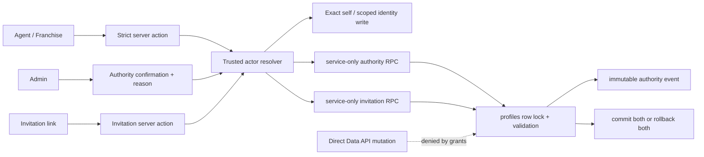

# Design: Profile Authority Hardening

Feature: `ZIN-SDD-041 profile-authority-hardening`.

Status: `design_ready`; SDD Gate 1 and Gate 2 approved by the product owner on 2026-08-03.

## Outcome

Make profile management feel simpler while removing `profiles` as an accidental authority API. A person keeps one small personal form. Fiscal, banking, invitation and internal-system operations keep their dedicated workflows. Role, hierarchy and franchise changes use one explicit Admin command with mandatory reason and atomic audit.

The resulting product flow is:

1. Sign-in resolves the actor from trusted server state and fails closed if the profile is missing or inactive.
2. The user edits only their personal identity fields in one short form.
3. An Admin changes organizational authority from the existing people/franchise surfaces, using a focused confirmation with a reason.
4. An invitation derives its authority from the locked invitation and creator records; the browser never submits a role, parent or franchise.
5. Every authority transition either commits together with one immutable event or makes no change.

No new primary navigation, role, dashboard or generic profile editor is introduced.

## Scope boundary

In scope:

- Classify every current `profiles` column and converge all existing writers on an explicit workflow.
- Revoke direct browser writes to `profiles` and preserve the existing read scopes.
- Add a trusted actor resolver and fail-closed behavior.
- Add an atomic, idempotent Admin authority command and invitation-consumption command.
- Add append-only authority-event storage with safe before/after state.
- Adapt onboarding, settings, IBAN, Admin people/franchise management, network member naming and invitations.
- Verify effective grants, policies and real Data API behavior on staging.

Out of scope:

- OCR/PII tenancy work (`ZIN-SDD-042`) and SIPS consent (`ZIN-SDD-043`).
- New organization levels or role semantics.
- Email-change orchestration, account deletion redesign or new Auth providers.
- Fiscal model, commission plan, economic snapshot or decommission-rule redesign.
- New customer-facing CRM stages or primary navigation.

## Product and security decisions

### D1. No direct authenticated writes to `profiles`

`PUBLIC`, `anon` and `authenticated` receive no table-level or column-level `INSERT`, `UPDATE` or `DELETE` privilege on `public.profiles`. Direct authenticated `SELECT` is re-granted only for the approved directory/authority projection: `id`, `email`, `full_name`, `phone`, `bio`, `timezone`, `role`, `parent_id`, `franchise_id`, `created_at` and `updated_at`. Email and phone remain ordinary PII: the projection is safe from fiscal/system leakage, not safe for unrestricted access or logging.

Fiscal, banking and internal-system columns are not readable through direct profile/network queries. Their existing server workflows provide scoped reads. Row policies are tightened to explicit self, Admin and legitimate network relationships; a manager relationship must also prove the actor is an active Franchise, while any intentionally preserved child-to-parent directory lookup sees only the approved projection.

All authenticated identity and authority writes enter through a server action that performs `requireServerRole(...)`, validates a strict input schema and calls a purpose-specific service-only RPC. Public creation of a not-yet-authenticated user is the sole formal exception: a rate-limited purpose-bound invitation route authorizes by a locked invitation/provisioning record and cannot choose authority. Existing fiscal and system operations keep their already dedicated service workflows. This deliberately avoids a partial write-grant design: PostgreSQL RLS controls rows but does not by itself create a safe column boundary, and mixed REST payloads would remain hard to reason about.

### D2. Exact self-service allowlist

The personal form calls `public.update_own_profile`, which may write only:

- `full_name`
- `phone`
- `bio`
- `timezone`

Unknown or protected keys are rejected. `target_id` is always taken from the authenticated session, passed as `actor_id`, and revalidated as an active profile inside the service-only RPC. The existing onboarding and settings actions remain as thin compatibility adapters so the UI does not branch into duplicate flows.

### D3. Authority is a command, not a profile form

`role`, `parent_id` and `franchise_id` can be changed only by the Admin command or the dedicated invitation/bootstrap command. The Admin UI asks for the intended transition and a normalized reason; it never submits an arbitrary profile object.

The command supports assignment, reassignment, removal, deactivation and reactivation while protecting organizational invariants. A single command prevents divergent rules across the Agents, Franchise and Network screens. `authority_version` provides optimistic concurrency independently of `updated_at`, which also changes during harmless self-service edits.

### D4. Invitation is the only non-Admin authority exception

Invitations are preserved because they are part of the current acquisition flow. They do not trust authority values from the client: role, parent and franchise are derived from the locked invitation and its trusted creator. An active Admin may issue/consume an invitation for an `agent` or `franchise`. An active Franchise may issue/consume only an `agent` invitation bound to that Franchise's own validated network. No invitation may create/attach an `admin`, and a Franchise can never create another Franchise.

This is an explicit Gate 1 refinement recorded in REQ-002, not an implicit code exception. Gate 2 approval includes approval of this purpose-bound invitation matrix.

Invitation registration uses one purpose-bound provisioning route and one atomic database finalization primitive. Because Supabase Auth and Postgres cannot share one transaction, it also uses a durable provisioning state machine; it never relies only on best-effort deletion after `createUser`.

### D5. Identity, fiscal and system fields stay separate

- A Franchise may correct only `full_name` for an Agent inside its validated network. This uses a scoped server workflow and cannot write authority, email, phone or fiscal data.
- `email` is an Auth-owned mirror. The current network editor stops writing it; a coordinated email-change product is future work.
- Fiscal data and IBAN remain in the fiscal workflow and invalidate fiscal verification when relevant.
- `fiscal_verified` and `fiscal_verified_at` remain Admin fiscal workflow fields, not authority-command payload.
- `drive_folder_id` remains Drive-system-only.
- `invoice_next_number` remains callable only through the existing transactional numbering function.
- Economic plan assignments remain in their versioned commission tables and never move into `profiles`.

### D6. Fail closed; never repair authority implicitly

The trusted actor resolver reads the session and canonical server profile. Missing profiles, `role = null`, unknown roles or inconsistent authority produce no privileged context.

`services/crm/shared.ts` stops creating fallback profiles, inventing `role = 'agent'` or substituting the HQ franchise. Recovery becomes an explicit Admin/support operation instead of a side effect of opening a CRM page.

## Current writer classification

| Column group | Columns | Approved writer after this feature |
|---|---|---|
| Personal self-service | `full_name`, `phone`, `bio`, `timezone` | Own-profile server workflow; `full_name` also has a tightly scoped subordinate-name workflow |
| Authority | `role`, `parent_id`, `franchise_id` | Atomic Admin command; trusted invitation/bootstrap exception |
| Fiscal/banking | `nif_cif`, fiscal address fields, `iban`, `company_name`, `company_type`, `invoice_prefix`, `retention_percent`, `invoice_tax_percent` | Existing dedicated fiscal/banking workflow |
| Fiscal approval | `fiscal_verified`, `fiscal_verified_at` | Dedicated Admin fiscal workflow |
| Auth mirror | `email` | Auth trigger/coordinated future identity workflow only |
| Internal system | `drive_folder_id`, `invoice_next_number` | Drive claim and invoice-number RPC only |
| Database/Auth managed | `id`, `created_at`, `updated_at` | Auth/database triggers only |

The expansion migration adds `authority_version bigint not null default 0`. It is not exposed to normal profile forms and increments only when the authority tuple changes.

The implementation inventory must cover these current entry points:

| Entry point | Design treatment |
|---|---|
| `updateAgentProfileAction`, onboarding | Adapter to own-profile workflow |
| `saveProfileSettingsAction` | Personal name goes to own-profile workflow; company data remains `franchise_config`; stop mapping company name to `full_name` |
| `saveIbanAction` | Adapter to dedicated banking/fiscal service workflow |
| `updateFiscalProfileAction`, fiscal verification | Preserve dedicated workflow; conform guards and exact fields |
| `updateAgentAdminAction` | Retire its combined payload: name delegates to scoped identity; role/franchise use a separate authority confirmation. Never simulate a two-domain atomic save |
| assign/remove franchise, deactivate/reactivate | Adapters to the atomic authority command with reason and request id |
| `updateNetworkUserAction` | Replace with scoped subordinate `full_name` workflow; remove isolated email mutation |
| `registerWithInvitationAction`, `completeInvitationAction` | Retire both in favor of the single purpose-bound provisioning route; an existing active account is never repurposed by invitation |
| `ensureProfile`, HQ fallback | Remove writes and invented authority; trusted read fails closed |
| Drive-folder claim and invoice numbering | Preserve as isolated system writers |
| Account deletion | Preserve as a separate destructive Auth workflow; no generic profile delete command |

Protected reader convergence is equally explicit:

| Current reader | Replacement contract |
|---|---|
| `profileFiscalService.getFiscalProfile()` from the browser | `getOwnFiscalProfileAction()` authorizes server-side and returns own fiscal fields plus `hasIban`/masked IBAN, never the stored full IBAN |
| `getIbanAction()`, wallet hook | Compatibility adapter to `getOwnWalletIdentityAction(): { role, hasIban, maskedIban }`; UI shows the ending and accepts a blank replacement field |
| `createWithdrawalRequestAction()` | After role/ownership validation, reads the full IBAN internally with the service client; it never returns it to the browser or logs it |
| invoicing fiscal readers using a session client | Dedicated authorized server loaders use the service client and return only the fields required by that screen/action |
| `getAllAgentsAction()` on Admin people surfaces | `getAdminProfileAuthoritySummariesAction()` returns `id`, display identity, authority tuple and `authorityVersion`; non-authority consumers keep a narrower adapter |

These readers are migrated before the column-level SELECT contract. The fiscal settings form displays masked existing IBAN and changes it only when the user intentionally enters a complete replacement, avoiding accidental resubmission of a mask.

## Architecture



The browser never receives the service-role key and never calls the protected RPCs. The key continues to exist only in `src/lib/supabase/service.ts`.

## Server interfaces

Names are design contracts; tasks may adjust exact filenames without weakening their boundary.

### Trusted actor context

```ts
type TrustedActor = {
  id: string
  role: 'admin' | 'franchise' | 'agent'
  franchiseId: string | null
  parentId: string | null
}

getTrustedActorProfile(): Promise<TrustedActor>
```

It is server-only, uses the authenticated user id and canonical profile, and rejects absent/inactive/invalid profiles. It performs no writes or fallback assignment. Mutating actions still call `requireServerRole(...)` before database writes as required by the project security rules.

Predicates are concrete:

- Active profile: row exists; Admin has `role = 'admin'`; Franchise or Agent has the exact role plus a non-null `franchise_id` referencing `franchises.is_active = true`. `role = null`, missing/inactive tenant or unknown role is pending/deactivated and receives no CRM authority.
- Active franchise scope: `profiles.role = 'franchise'`, `franchise_id` is non-null and the referenced `franchises` row exists with `is_active = true`.
- Direct managed Agent: target has `role = 'agent'`, `parent_id = actor.id`, `franchise_id = actor.franchise_id` and the shared franchise is active at the locked write predicate.
- Admin: canonical profile has `role = 'admin'`; authority commands additionally revalidate it under lock and reject inconsistent legacy tuples identified by preflight.

No recursive descendant-management permission is inferred in this feature. Legacy deeper hierarchies remain Admin-managed until explicitly redesigned.

### Own profile

```ts
updateOwnProfileAction({
  fullName,
  phone,
  bio,
  timezone,
}): Promise<ActionResult>
```

The schema is strict, derives the target from the session and calls service-only `public.update_own_profile` with that same actor/target id. The RPC revalidates the active profile and updates exactly the four named columns. Existing action names may delegate to it during the migration. This workflow does not accept `email`, company, fiscal, hierarchy or arbitrary metadata.

### Scoped subordinate name

```ts
updateTeamMemberNameAction({
  targetId,
  fullName,
}): Promise<ActionResult>
```

Admin may target any valid non-deleted profile. Franchise may target only an active Agent in its canonical descendant scope. The action calls service-only `public.update_team_member_name`; that RPC revalidates actor and target under lock and repeats target scope in the write itself so a stale pre-check cannot expand access.

### Admin authority command

```ts
changeProfileAuthorityAdminAction({
  targetId,
  desiredRole,
  parentId,
  franchiseId,
  expectedAuthorityVersion,
  reasonCode,
  requestId,
}): Promise<ActionResult<{ eventId: string }>>
```

The action requires Admin, performs UI-safe parsing and calls one service-only transactional RPC. `desiredRole = null` represents deactivation; reactivation must state the full intended authority instead of recovering a remembered client value.

Canonical stored tuples are:

- Admin: `role = 'admin'`, `parent_id = null`, `franchise_id = null`.
- Franchise: `role = 'franchise'`, `parent_id` references an active Admin, and `franchise_id` references an active franchise.
- Agent: `role = 'agent'`, `franchise_id` references an active franchise, and `parent_id` references either an active Admin (direct/HQ commercial) or an active Franchise with the same `franchise_id`.
- Pending/deactivated: `role = null`, `parent_id = null`, `franchise_id = null`.

Deactivation and franchise removal clear the full tuple rather than leaving half-active authority. Reactivation, assignment and reassignment always submit a complete canonical tuple. Preflight sends incompatible legacy tuples to Admin review without guessing.

The RPC:

1. Locks actor and target profiles.
2. Re-resolves the actor as an active Admin inside the transaction.
3. Returns the prior result for the same `requestId`, or rejects reuse with different semantic input.
4. Rejects self-authority changes.
5. Rejects a stale `expectedAuthorityVersion`.
6. Validates the desired role and all referenced profiles/franchises.
7. Rejects missing/inactive franchise references.
8. Rejects `parent_id = target_id` and hierarchy cycles using a recursive check.
9. Enforces parent/franchise coherence and permitted role relationships.
10. Prevents demotion/deactivation of the final active Admin.
11. Updates only `role`, `parent_id`, `franchise_id` and increments `authority_version`.
12. Produces one safe immutable event through the database guard/audit trigger.
13. Commits both records or neither.

Proposed database signature:

```sql
public.change_profile_authority(
  p_actor_id uuid,
  p_target_id uuid,
  p_desired_role text,
  p_parent_id uuid,
  p_franchise_id uuid,
  p_expected_authority_version bigint,
  p_reason_code text,
  p_request_id uuid
)
```

It is `SECURITY INVOKER`, uses a pinned empty `search_path`, schema-qualifies every object, and is executable only by `service_role`. The guarded server action obtains `p_actor_id` from `auth.getUser()`; that application boundary is the primary identity binding. Database revalidation prevents stale/demoted/non-Admin actors and TOCTOU, but it does not claim to cryptographically distinguish callers that already possess the service-role key. Static architecture tests therefore allow this RPC call only from the canonical guarded command module, while the service-role secret remains confined to `src/lib/supabase/service.ts`. Private RLS helpers remain `SECURITY DEFINER` with `search_path = ''` to avoid recursive profile-policy evaluation; they are not moved into an exposed schema or converted to invoker functions.

### Invitation consumption

```ts
consumeNetworkInvitationProfile({
  invitationId,
  expectedEmail,
  fullName,
  requestId,
}): Promise<ActionResult<{ eventId: string }>>
```

The service-only RPC locks invitation, target profile and creator, validates email/expiry/unused state, derives `role`, `parent_id` and `franchise_id`, updates the profile, marks the invitation used and appends an event in one transaction. `expectedEmail` is compared in normalized form but is never written to the audit event. Invitation id plus request id produces stable retries.

Every Admin-created Agent or Franchise invitation needs an existing active franchise entity. The expansion migration therefore adds nullable `network_invitations.target_franchise_id`; it is required for Admin invitations and omitted for Franchise -> Agent because that path derives the creator's own franchise. The creation action accepts the requested id, but the server validates and persists the canonical active franchise before consumption. Authority consumption always reads the locked invitation snapshot rather than a browser value.

### Public invitation provisioning

`registerWithInvitationAction` is replaced by a rate-limited `POST /api/join/provision` route because the user has no authenticated profile on the first request and therefore cannot truthfully pass `requireServerRole(...)`. The route accepts invitation code/id, normalized matching email, full name, password and request id; none of these selects authority. Password is sent only to Supabase Auth and is never stored in Postgres, logs or telemetry.

Rate limiting uses a shared service-only Postgres store, not process memory. It keeps peppered hashes rather than raw IP/email, with 24-hour retention: at most 10 attempts per 10 minutes for source+invitation and 5 attempts per 30 minutes for invitation+email. Limit failures return one generic response and do not reveal invitation/email validity.

The versioned `handle_new_user()` bootstrap is changed to insert a neutral profile with `role = null`, `parent_id = null` and `franchise_id = null`; it never grants `agent` implicitly and never overwrites authority on conflict. The legacy unaffiliated `signup` action is removed and public Auth self-registration is disabled and verified in every environment. All supported user creation goes through the invitation provisioning workflow; no manual/dashboard Auth creation is an activation path. Existing valid profiles are not rewritten.

The expansion migration adds a service-only `profile_invitation_provisioning` record with unique invitation id, unique request id and unique nullable Auth user id; `status` (`prepared`, `auth_created_blocked`, `authority_committed`, `completed`, `needs_reconciliation`); safe error code; and timestamps. RLS is enabled and all browser privileges are revoked. It duplicates no email; the invitation remains the email source. Its flow is:

1. A begin RPC locks and validates the unused invitation and creates/returns the durable provisioning row.
2. If no Auth user is recorded, the route creates one already banned for a long provisioning duration, with confirmed email and a server-owned provisioning id in Auth app metadata. Because it is banned before any sign-in, no session/JWT exists in the crash window.
3. A record RPC persists the returned Auth user id and `auth_created_blocked` state after verifying `banned_until` is in the future.
4. The invitation-consumption RPC requires the target profile to remain neutral, then atomically updates the profile, marks the invitation used, appends the authority event and marks provisioning `authority_committed`.
5. Only after that commit, the route calls the Supabase Admin API to lift the ban (`ban_duration = 'none'`) and verifies `banned_until` is cleared, then marks provisioning `completed`.
6. A retry returns/resumes the same provisioning regardless of whether the browser reused or regenerated its request id; the invitation unique key is the outer idempotency boundary.
7. If the process dies after Auth creation but before step 3, the retry/reconciliation path locates the Auth user by the invitation email and accepts it only when its server-owned app metadata matches the provisioning id. It then resumes from the persisted state.
8. If unbanning fails after authority commit, the account remains unable to sign in and the reconciler safely retries enablement. If the response is lost after unbanning, it verifies Auth plus the unique event before marking completed.
9. A reconciler reports durable incomplete states. It may delete a still-banned Auth user only after matching that server-owned provisioning id, proving the invitation is unconsumed and proving no domain records exist; otherwise it marks Admin review. It never deletes an existing unrelated account by email.

An existing Auth account, whether active or neutral, is not repurposed by a public invitation because a ban cannot revoke already-issued JWTs. It is sent to Admin review and any legitimate authority change uses the Admin command. The authority event records the invitation creator as `actor_id`, the new user as `target_profile_id`, and the invitation/provisioning ids as source provenance.

Public invitation validation returns only validity, a masked email hint and a localized invited-role label. It does not expose creator ids, full email or raw authority fields. Creation, validation and provisioning share the same server-side invitation matrix.

The reconciler runs every five minutes through `/api/cron/reconcile-invitation-provisioning`. The route requires `Authorization: Bearer CRON_SECRET` before any service-role work, processes at most 100 incomplete rows older than two minutes and emits a non-PII alert when a row remains incomplete for 15 minutes or enters `needs_reconciliation`. Rate-limit cleanup uses the same authenticated cron boundary.

### Dedicated workflows retained

- `updateOwnFiscalProfileAction(input)`
- `verifyFiscalProfileAdminAction({ targetId, reasonCode })`
- `updateOwnIbanAction({ iban })`
- Drive-folder claim helper
- Transactional invoice-number RPC

Each action constructs an exact field set. No generic `updateProfile(id, payload)` helper is introduced.

## Authority transition rules

| Transition | Allowed actor | Required conditions | Result |
|---|---|---|---|
| Agent assignment/reassignment | Admin | Existing target; active franchise; valid parent; no cycle; coherent scope | Full role/parent/franchise tuple replaces prior tuple |
| Franchise assignment/reassignment | Admin | Existing target; valid hierarchy; active franchise record | Full coherent tuple replaces prior tuple |
| Promote to Admin | Admin | Not self; explicit reason; parent cleared | Admin authority; no implicit economic assignment |
| Deactivate | Admin | Not self; target is not final Admin | Full tuple becomes `role = parent_id = franchise_id = null`; resolver fails closed |
| Reactivate | Admin | Explicit complete desired tuple | No restoration from browser-cached role |
| Admin invitation acceptance | Trusted invitation command | Valid, unexpired, unused invitation; matching user email; active Admin creator; role Agent or Franchise | Derived tuple only; invitation and audit commit together |
| Franchise invitation acceptance | Trusted invitation command | Valid, unexpired, unused invitation; matching user email; active Franchise creator; role Agent; target bound to creator's validated network | Derived Agent tuple only; invitation and audit commit together |
| Self/Franchise authority attempt | Any non-Admin | Always invalid | No profile or audit mutation |

### Invitation derivation matrix

| Creator | Requested invitation | Required trusted state | Resulting `role` | Resulting `parent_id` | Resulting `franchise_id` | Event actor | Decision |
|---|---|---|---|---|---|---|---|
| Active Admin | Agent | Creator remains active Admin; `target_franchise_id` names an existing active franchise | `agent` | Admin creator id | Locked target franchise id | Admin creator id | Allowed; direct Zinergia/HQ agents use an explicit active HQ franchise, never a fallback |
| Active Admin | Franchise | `target_franchise_id` names an existing active franchise | `franchise` | Admin creator id | Locked target franchise id | Admin creator id | Allowed |
| Active Franchise | Agent | Creator has a non-null, existing active `franchise_id` | `agent` | Franchise creator id | Creator's locked franchise id | Franchise creator id | Allowed |
| Active Franchise | Franchise | Irrelevant | — | — | — | — | Rejected at invitation creation and consumption |
| Missing/inactive/null-role creator | Any | Invalid creator authority | — | — | — | — | Rejected |
| Admin with `franchise_id = null` | Agent | Valid Admin and valid active `target_franchise_id` | `agent` | Admin creator id | Locked target franchise id | Admin creator id | Allowed; creator need not belong to the target franchise |
| Admin with `franchise_id = null` | Franchise | Valid active `target_franchise_id` still required | `franchise` | Admin creator id | Locked target franchise id | Admin creator id | Allowed only with target franchise |

The accepting user's id is the event target, not the event actor. `full_name` is ordinary identity input and does not affect this matrix. Any stored legacy Franchise -> Franchise invitation is rejected during preflight/consumption and offered for Admin review; it is never grandfathered into authority. Any legacy Agent/Franchise profile without a valid active franchise enters the same explicit Admin assignment queue and receives no tenant-scoped fallback.

Reason codes are a closed, non-PII set such as `role_change`, `franchise_assignment`, `franchise_removal`, `deactivation`, `reactivation`, `invitation_acceptance`, `authority_correction` and `security_recovery`. The UI may explain them in Spanish; free text is not stored in the authority event.

## Audit data model

A new migration creates `public.profile_authority_events` with:

- `id uuid primary key`
- `actor_id uuid not null`
- `target_profile_id uuid not null`
- `event_type text not null`
- `reason_code text not null`
- `before_state jsonb not null`
- `after_state jsonb not null`
- `request_id uuid not null unique`
- `before_version bigint not null`
- `after_version bigint not null`
- optional non-PII `source_type` and `source_id` for invitation provenance
- `created_at timestamptz not null default now()`

`before_state` and `after_state` contain only `role`, `parent_id` and `franchise_id`. They never contain email, phone, name, fiscal data, CUPS, DNI, tokens or free text.

Actor, target and optional source identifiers are retained UUID values without a restrictive foreign key back to `profiles`. This preserves immutable security evidence without preventing the existing account-deletion/RGPD workflow from removing the live profile. Display-name enrichment, when authorized, is resolved at read time and is not copied into the event.

RLS is enabled. Direct insert/update/delete/truncate privileges are revoked from browser roles. Admin has a read-only policy through the existing private Admin helper. Row-level `BEFORE UPDATE OR DELETE` triggers and a statement-level `BEFORE TRUNCATE` trigger reject mutation even for accidental privileged calls. The legacy best-effort `audit_logs` helper may remain for non-authoritative UI events but is not evidence for REQ-003.

A `BEFORE UPDATE` profile guard rejects changes to `role`, `parent_id`, `franchise_id` or `authority_version` unless the canonical authority RPC has installed transaction-local command context. An `AFTER UPDATE` trigger writes the event from `OLD`/`NEW` and that context. This prevents current or future service-role code from accidentally bypassing the audit. The same guarded pattern applies to the invitation RPC. If event insertion fails, PostgreSQL rolls back the profile update.

## Database migration design

The work uses new timestamped files under `supabase/migrations/`; no applied migration is edited.

### Expansion migration

- Create the append-only event table, constraints, indexes, RLS and read policy.
- Add `profiles.authority_version` for authority-specific optimistic concurrency.
- Add private validation helpers only where reuse materially improves the RPCs.
- Add the service-only Admin and invitation RPCs.
- Add the service-only own-profile and scoped subordinate-name RPCs.
- Replace `handle_new_user()` with neutral, non-overwriting bootstrap semantics and verify the effective Auth trigger before relying on it.
- Install the protected-field guard/audit trigger initially in explicit compatibility mode: commands with valid transaction context produce atomic events, while inventoried legacy authority writes remain temporarily permitted and metrically visible until application convergence. This interval is short in staging and repeats only inside the monitored production expand -> app -> contract release window.
- Revoke default/public function execution explicitly and grant only `service_role`.
- Pin function `search_path = ''` and schema-qualify references.
- Add necessary authority constraints only after a preflight report proves current values are compatible; ambiguous legacy rows remain a reviewed queue, not guessed data.

### Application convergence

- Deploy server actions and compatibility adapters that use the four purpose-specific commands.
- Remove implicit profile repair/HQ fallback.
- Change the current UI to collect authority reason codes and stop isolated email editing.
- Canary all listed writers on staging while the old broad grant still exists.

### Contract migration

- Drop the broad `Users can update own profile` update policy.
- Revoke `INSERT`, `UPDATE` and `DELETE` on `public.profiles` from `PUBLIC`, `anon` and `authenticated`.
- Revoke broad table `SELECT`, then re-grant only the approved directory/authority columns to `authenticated`.
- Tighten and re-verify row policies for self, Admin and legitimate Franchise/network directory relationships.
- Route fiscal, banking, Drive and other protected reads through their dedicated server workflows before the column contract.
- In the same cutover transaction, switch the protected-field guard from compatibility mode to fail-closed: every authority change without valid canonical command context fails, including a direct `service_role` update.
- Harden bootstrap/trigger execution and search paths without exposing a browser function.
- Add structural assertions/verifiers for the final effective state.

The two migrations remain versioned source of truth. Promotion uses an explicit expand -> app -> verify -> contract checkpoint so an older app is never placed behind already-contracted grants.

After applying schema changes, regenerate `src/types/database.types.ts` with the project-mandated Supabase command and commit the migration and generated types together.

## UI behavior

The objective is fewer decisions for ordinary users:

- Onboarding keeps the current name/phone step and submits through the own-profile workflow.
- Settings presents personal identity independently from company/fiscal settings; it no longer maps company name into personal name.
- IBAN keeps its current surface but uses the banking workflow internally.
- Admin Agents/Franchises screens retain their current location. Changing role, hierarchy, franchise or active state opens one concise confirmation showing current -> proposed state and a required reason selection.
- Admin identity and authority are deliberately separate saves: `Editar nombre` calls the scoped identity workflow; `Cambiar autoridad` opens the shared authority confirmation. The old combined `updateAgentAdminAction` payload is removed rather than issuing two partially successful commits.
- Franchise network editing shows only the subordinate name field. Email is read-only and authority controls are absent.
- Invitation acceptance has no new authority inputs and remains one clear completion path.

An absent, invalid or deactivated profile gets one non-technical account state instead of a broken dashboard: a clear pending/suspended message, sign-out action and support contact. It never receives an invented Agent/HQ fallback.

Mutations expose a pending state, prevent double submission through the request id, return field-safe errors and refresh only the affected profile/list. No raw database or PII values appear in client errors or logs.

## Verification strategy

### Structural database verification

Run against linked staging and assert effective, not merely declared, state:

- `PUBLIC`, `anon` and `authenticated` lack profile insert/update/delete privileges, including column-level grants.
- Authenticated has only the explicit directory/authority column SELECT grant; fiscal, banking and internal columns have no direct Data API grant.
- SELECT policies prove actor role as well as relationship and do not expose unrelated tenants.
- Protected RPCs have empty pinned search paths and only `service_role` execute.
- Event table RLS, read-only Admin policy, unique request id and row/statement-level append-only enforcement exist.
- Provisioning table RLS, service-only grants and unique invitation/request/Auth-user constraints exist; no password/email duplicate column exists.
- The protected-field guard is enabled and no public wrapper can install a successful authority mutation.
- A negative direct `service_role` authority update proves the final guard is fail-closed; only a canonical command with valid context succeeds.
- Private SECURITY DEFINER RLS helpers retain empty search paths and execute without recursion for every role fixture.
- Existing fiscal, Drive and invoice-number writers retain only their intended capability.

### Transactional verification

Use synthetic staging fixtures and roll back all writes. Cover:

- Valid assignment, reassignment, removal, deactivation and reactivation.
- Invalid role, missing/inactive franchise, invalid parent, self-parent and multi-level cycle.
- Actor not Admin, missing actor profile, `role = null`, actor/target self-edit and last-Admin protection.
- Stale `authority_version` and concurrent conflicting transitions.
- Exactly one event with safe before/after state.
- Missing/invalid reason, audit failure and validation failure leave the target unchanged.
- Same request id returns stable success without duplicate event; semantic mismatch is rejected.
- Invitation expiry, email mismatch, creator scope, non-Admin role restriction, concurrent consumption and retry.
- Every row of the invitation derivation matrix, including legacy Franchise -> Franchise rejection and Admin Franchise invitation without a target franchise.
- Provisioning crashes at every boundary: before Auth creation, after blocked Auth creation/before recording, after recording/before authority commit, after authority commit/before unban and after unban/before response. Every retry converges to one Auth user, one consumed invitation and one authority event or an explicit review state.
- In every pre-enable crash window, password login is rejected by Supabase Auth because `banned_until` remains in the future; no JWT exists to reach Data API policies that only check ownership.
- Ban is never treated as a way to revoke an existing session. The workflow bans only newly created users before their first sign-in; existing accounts use Admin review.

### Data API and role matrix

| Actor | `GET profiles` | Direct `INSERT/UPDATE/DELETE` | Own-profile workflow | Authority workflow |
|---|---|---|---|---|
| anon | No profile rows/columns | Denied | Denied | Denied |
| Provisioning user, Auth-blocked | Password sign-in denied; no JWT exists | Cannot reach Data API | Not available | Only purpose-bound provisioning may resume |
| Agent A | Intended row-scoped directory/authority projection only; fiscal/system columns denied | Own, same-franchise Agent B and external target denied; allowed/protected/mixed/unknown payloads all denied | Only own four fields | Denied |
| Agent B, same franchise | Symmetric intended row scope; no fiscal/system columns | All direct writes denied | Only own four fields | Denied |
| Agent, other franchise | Isolated row scope; no cross-tenant or fiscal/system columns | All direct writes denied | Only own four fields | Denied |
| Franchise | Validated network directory/authority projection only | Own/subordinate/external direct writes denied | Own four fields; subordinate name only through scoped workflow | Denied |
| Admin JWT | Global directory/authority projection; protected detail through Admin server workflows | Direct browser writes denied | Own four fields | Valid command succeeds; invalid command is atomic failure |
| service role | Structural/backend verification only | Never exposed to browser | Not applicable | Callable only behind guarded server command |

### Compatibility smoke tests

- Onboarding and settings personal profile.
- Settings company data remains in `franchise_config`.
- Fiscal profile, fiscal verification and IBAN save.
- Fiscal/IBAN masked reads, explicit IBAN replacement and withdrawal/invoice internal full-IBAN reads with no browser exposure.
- Admin person update, franchise assignment/removal, role change, deactivate/reactivate.
- Independent Admin name save versus authority save; neither failure partially claims success for the other.
- Franchise subordinate name correction and prohibited email/authority attempt.
- New-user neutral bootstrap and blocked registration invitation through final unban. Auth-user compensation may delete only a still-banned user created by the same provisioning after proving the invitation remains unconsumed and the user has no domain records.
- Public self-signup is disabled and the legacy action has no reachable product surface.
- CRM pages with missing/inactive profile fail closed rather than assigning HQ.
- Drive folder claim and concurrent invoice numbering.
- Commission/fiscal historical snapshots remain byte-for-byte unchanged by authority commands.

### Repository quality gates

- Focused domain, action, migration-contract and UI tests.
- `npx tsc --noEmit`
- `npm run lint`
- `npm run test`
- `npm run build`
- `npm run test:e2e` only with the documented staging variables; otherwise record it as skipped.
- Authenticated desktop and 390px checks for changed confirmations/forms, including keyboard and accessible errors.

## Observability and privacy

Emit only structured, non-PII operational signals:

- workflow name;
- allowed/denied;
- actor role;
- target relationship class;
- field class;
- reason code;
- safe error code;
- request id.

Do not log names, email, phone, fiscal data, CUPS, DNI, invitation email or before/after identity values. Alert on any successful direct Data API write, invalid-profile fallback attempt, repeated denied authority command, or authority mutation without a corresponding event. The last condition should be structurally impossible because the event and update share one transaction.

## Rollout and recovery

1. Preflight staging data for invalid roles, missing franchises, parent cycles and orphan references. Do not repair ambiguous records automatically.
   Also inspect live grants, column grants, policies, function owners/BYPASSRLS, Auth trigger and function definitions because versioned migrations do not prove their effective state.
2. Apply the expansion migration to staging.
3. Deploy application convergence to staging and run the full writer inventory, matrix and smoke suite.
4. Apply the contract migration to staging and repeat structural/Data API verification.
5. Regenerate types from the linked staging schema and pass repository gates.
6. Promote production in the same expand -> compatible app -> contract order with a short monitored checkpoint.
7. Keep request-id semantics compatible through the rollout so retries across a deploy are safe.

The DB expansion, neutral Auth trigger, purpose-bound API, compatible server actions/UI and DB contract are one indivisible release plan. Production does not reach contract until the compatible API/UI and provisioning reconciler are deployed and healthy; implementation tasks may be sliced, but promotion cannot omit one layer.

Rollback never restores broad profile writes or returns the protected-field guard to compatibility mode. Before contract, application rollback may use the previous compatible app while the expansion objects remain inert. After contract, use a mutation kill switch plus reviewed forward fix; do not redeploy an app that depends on direct authenticated updates. Database event history is append-only and retained.

## Requirement traceability

| Requirement | Design evidence |
|---|---|
| REQ-001 | D1/D2, strict own-profile action, direct-write revocation, Data API matrix |
| REQ-002 | D3/D4/D5, transition table, Admin and invitation commands |
| REQ-003 | Atomic RPC plus `profile_authority_events`, reason codes and idempotency tests |
| REQ-004 | Trusted actor resolver, in-transaction actor validation, removal of HQ/role fallback |
| REQ-005 | Effective staging grant/policy verifier and full actor matrix |
| REQ-006 | Expand/contract migrations, generated types, compatibility rollout and forward-fix recovery |

## Gate 2 acceptance criteria

The design is ready for task decomposition when the product owner confirms:

- Direct authenticated `profiles` writes are intentionally unsupported.
- Direct authenticated profile reads are restricted to the approved, row-scoped directory/authority projection; fiscal, banking and internal fields use dedicated server reads.
- The exact four-field self-service allowlist is correct.
- The invitation derivation matrix is correct: Admin -> Agent or Franchise bound to an explicit active franchise; Franchise -> Agent in its own active network; never Admin authority or Franchise -> Franchise.
- Franchise can correct only a subordinate's name, not email or authority.
- Admin name and authority changes are separate, explicit saves rather than one combined profile mutation.
- Admin authority changes require a normalized reason and create atomic immutable evidence.
- The rollout uses expand -> compatible app -> contract and never restores the broad update policy.

No `tasks.md`, migration or application code is created before this gate is approved.
